# Projeto de Infraestrutura de Rede: Cooperativa BluCoop

**Pontifícia Universidade Católica de Minas Gerais**  
Instituto de Ciências Exatas e de Informática

## Autores

| Nome | Vínculo | E-mail |
| --- | --- | --- |
| Anna Luiza Laudares A. P. Silva | Aluna do Programa de Graduação em Sistemas de Informação | 1274879@sga.pucminas.br |
| Bernardo Pereira Pinto | Aluno do Programa de Graduação em Sistemas de Informação | 1456385@sga.pucminas.br |
| Camille Parma Vitoria | Aluna do Programa de Graduação em Sistemas de Informação | 1509770@sga.pucminas.br |
| Catharina Perdigão Carneiro | Aluna do Programa de Graduação em Sistemas de Informação | 1504927@sga.pucminas.br |
| João Victor Silva Farchi | Aluno do Programa de Graduação em Sistemas de Informação | 1520698@sga.pucminas.br |
| Lucas Filipe Santos Lima | Aluno do Programa de Graduação em Sistemas de Informação | 1527133@sga.pucminas.br |
| Marcus Paulo Oliveira Silva | Aluno do Programa de Graduação em Sistemas de Informação | 1517072@sga.pucminas.br |
| Fábio Leandro Rodrigues Cordeiro | Professor do Programa de Graduação em Sistemas de Informação | fabio@sga.pucminas.br |

## Resumo

A cooperativa de crédito BluCoop, com atuação no Vale do Itajaí, possui uma estrutura distribuída entre matriz e filiais, o que torna a infraestrutura de rede um elemento essencial para garantir a integração, segurança e continuidade das operações. Diante da crescente dependência de sistemas digitais e da necessidade de comunicação eficiente entre as unidades, este projeto tem como objetivo analisar e propor uma solução de infraestrutura de rede adequada às demandas da cooperativa. A proposta contempla o planejamento de uma arquitetura baseada em topologia estrela, integrando redes locais (LAN) e uma rede de longa distância (WAN), com centralização de serviços críticos na matriz e suporte às operações nas filiais. Foram definidos serviços essenciais como DNS, DHCP, FTP, VoIP e acesso remoto via VPN, além da segmentação entre rede corporativa e rede pública para maior segurança. Como resultado, a solução apresentada oferece maior desempenho, escalabilidade, confiabilidade e controle da rede, contribuindo para a eficiência operacional e o fortalecimento tecnológico da BluCoop.

> Artigo apresentado ao Instituto de Ciências Exatas e Informática da Pontifícia Universidade Católica de Minas Gerais, campus Contagem, como pré-requisito parcial para obtenção do título de Bacharel em Sistemas de Informação.

## 1 Introdução

Fundada em 1985, a BluCoop é uma cooperativa de crédito regional criada a partir da iniciativa de trabalhadores que buscavam alternativas mais justas às altas taxas praticadas pelas instituições financeiras tradicionais. Com atuação no Vale do Itajaí, em Santa Catarina, a cooperativa está presente nas cidades de Blumenau, Gaspar, Pomerode, Timbó, Indaial e Ascurra, contando com cinco filiais, aproximadamente 120 mil cooperados e cerca de 116 colaboradores distribuídos entre as agências e a matriz. Além de suas soluções financeiras diferenciadas, a BluCoop também investe em educação financeira e ações sociais, contribuindo diretamente para o fortalecimento da economia regional. Seu crescimento sustentável e sua atuação comunitária consolidam a cooperativa como uma instituição financeira comprometida com o desenvolvimento do Vale do Itajaí.

Atualmente, a eficiência operacional de instituições financeiras está diretamente relacionada à qualidade de sua infraestrutura tecnológica. Para uma cooperativa com matriz e múltiplas filiais, a conectividade torna-se elemento estratégico, garantindo integração entre unidades, segurança das informações, confiabilidade dos dados e continuidade das operações. Uma estrutura de rede inadequada pode comprometer a comunicação interna, expor vulnerabilidades de segurança e afetar a qualidade dos serviços prestados aos cooperados.

Diante desse cenário, torna-se essencial o planejamento de uma arquitetura de rede que assegure desempenho, segurança e escalabilidade, alinhada às necessidades estratégicas, operacionais e administrativas da BluCoop. Assim sendo, este projeto tem como objetivo analisar e propor soluções de infraestrutura que aliem viabilidade técnica e econômica à integração eficiente entre matriz e filiais, fortalecendo a competitividade e a sustentabilidade da cooperativa.

## 2 História da Cooperativa

O ano de 1980 foi um período desafiador para trabalhadores e pequenos empreendedores da região do Vale do Itajaí, em Santa Catarina. Na época, os bancos tradicionais praticavam cobranças excessivas e altas taxas de juros, o que dificultava o acesso ao crédito e gerava grande insatisfação, pois limitava o desenvolvimento econômico local.

Diante dessa realidade, um grupo de trabalhadores da Dudalina, uma empresa têxtil da região localizada na cidade de Blumenau, decidiu se unir com um propósito comum: criar uma alternativa financeira mais justa, acessível e colaborativa. Inspirados pelos princípios do cooperativismo, como ajuda mútua, gestão democrática e participação econômica dos membros, esses trabalhadores deram início a um movimento de união financeira que viria a transformar a realidade da comunidade local.

Assim, nasceu oficialmente a BluCoop em 1985, uma cooperativa de crédito fundada com o objetivo de oferecer serviços financeiros com taxas mais justas, transparência e foco no desenvolvimento regional. Desde a sua criação, a BluCoop adotou o modelo cooperativista, no qual os próprios associados são os donos da instituição, participando das decisões e compartilhando os resultados obtidos.

Ao longo dos anos, a BluCoop expandiu suas operações, ampliou seu quadro de associados e diversificou seus serviços, passando a atender não apenas trabalhadores, mas também empresas, empreendedores e produtores locais. Hoje, sua atuação contribui diretamente para o fortalecimento da economia do Vale do Itajaí, promovendo inclusão financeira, apoio ao crescimento de pequenos negócios e incentivo à educação financeira.

## 3 Missão, Visão e Valores

### 3.1 Missão

Promover o crescimento econômico e o bem-estar social dos associados, oferecendo soluções financeiras justas, personalizadas e baseadas nos princípios do cooperativismo.

A cooperativa BluCoop apresenta alinhamento com alguns dos Objetivos de Desenvolvimento Sustentável (ODS) propostos pela Organização das Nações Unidas (ONU), especialmente aqueles relacionados à educação, ao desenvolvimento econômico e à promoção de comunidades mais sustentáveis, (ODS 4, 8 e 11), que dialogam diretamente com as iniciativas e serviços planejados pela cooperativa.

O ODS 4 busca assegurar educação inclusiva e de qualidade, o que se conecta com o Ambiente Virtual de Aprendizagem (AVA) disponibilizado pela BluCoop, o qual é voltado à comunidade e aos cooperados. Essa plataforma permitirá a oferta de conteúdos educativos relacionados à educação financeira, ao cooperativismo, ao empreendedorismo e ao uso de tecnologias digitais, de forma a ampliar o acesso ao conhecimento e promover a capacitação da população.

O ODS 8, por sua vez, tem como finalidade promover o crescimento econômico sustentável, bem como o trabalho decente para todos. A BluCoop se relaciona com esse objetivo ao oferecer serviços financeiros voltados ao fortalecimento da atividade econômica local. Ao facilitar o acesso ao crédito e a instrumentos financeiros, a cooperativa contribui para o desenvolvimento de pequenos empreendimentos e geração de emprego na comunidade em que está inserida.

Por fim, o ODS 11 busca tornar as cidades e os assentamentos humanos mais inclusivos, seguros, resilientes e sustentáveis. Nesse contexto, a BluCoop contribui ao promover iniciativas que fortalecem o desenvolvimento socioeconômico local e incentivam a participação comunitária por meio do cooperativismo. A oferta de serviços financeiros acessíveis, associada ao uso de tecnologias digitais e a ações educativas voltadas à comunidade, favorece a inclusão financeira e o fortalecimento das redes econômicas locais. Dessa forma, a cooperativa atua como um agente de desenvolvimento regional, contribuindo para a construção de comunidades mais sustentáveis.

### 3.2 Visão

Ser reconhecida como a principal parceira no desenvolvimento da comunidade do Vale do Itajaí, inspirando confiança e prosperidade coletiva através da união.

### 3.3 Valores

- Crescimento sustentável;
- Ética e transparência;
- Pessoas no centro;
- Cidadania financeira (educação, acessibilidade e inclusão).

## 4 Público-Alvo

A BluCoop, enquanto cooperativa de crédito de pequeno porte com atuação regional, direciona suas atividades para pessoas físicas e jurídicas que buscam soluções financeiras mais acessíveis, atendimento humanizado e participação em uma instituição baseada nos princípios do cooperativismo.

Em número total, a cooperativa possui hoje 120 mil cooperados ativos em sua base. No segmento de pessoas físicas, a cooperativa atende trabalhadores assalariados, servidores públicos, profissionais autônomos e microempreendedores individuais (MEIs). Já no segmento de pessoas jurídicas, a BluCoop concentra-se em micro e pequenas empresas, negócios familiares e produtores rurais de pequeno porte.

Geograficamente, a cooperativa atua de forma regionalizada, atendendo municípios próximos às suas filiais e fortalecendo a economia local. Seu público caracteriza-se por valorizar confiança, transparência, taxas mais justas e relacionamento de longo prazo, preferindo uma instituição financeira que compreenda as necessidades da comunidade e contribua diretamente para seu crescimento sustentável.

| Unidade | Cidade em que se localiza |
| --- | --- |
| Central (Matriz) | Blumenau |
| Filial 01 | Gaspar |
| Filial 02 | Timbó |
| Filial 03 | Indaial |
| Filial 04 | Pomerode |
| Filial 05 | Ascurra |

## 5 Serviços Oferecidos

A BluCoop disponibiliza um portfólio diversificado de serviços financeiros, digitais e institucionais, estruturado para atender às necessidades de seus cooperados e garantir eficiência operacional em suas unidades. Como cooperativa de crédito regional, sua atuação está pautada na oferta de soluções acessíveis, seguras e alinhadas aos princípios do cooperativismo, promovendo inclusão financeira, desenvolvimento econômico local e atendimento personalizado.

**Serviços Financeiros:**

- Modalidades de contas, como Conta Corrente, Conta Salário e Conta Poupança;
- Opções conservadoras de investimentos e aplicações financeiras;
- Variedade de seguros e consórcios;
- Empréstimos e financiamentos (rurais e comerciais);
- Crédito consignado;
- Fundos cooperativos;
- Cartões de débito e crédito próprios da BluCoop;
- Caixas de atendimento eletrônico (ETMs).

**Serviços Digitais:**

- Aplicativo para gestão financeira (BluCoop App);
- Plataforma de Internet Banking;
- PIX, pagamentos e transferências bancárias;
- Central de Atendimento telefônico ao cooperado (SAC);
- Suporte automatizado por chatbot via WhatsApp;
- Assistente virtual integrado ao BluCoop App.

**Serviços para Pessoas Jurídicas:**

- Conta corrente empresarial (Conta PJ);
- Linhas de crédito específicas para empreendedores;
- Crédito para capital de giro;
- Processamento e administração da folha salarial;
- Gestão de cobranças por boletos.

**Iniciativas Comunitárias:**

- Ambiente virtual com cursos voltados para educação financeira;
- Incentivo a atividades culturais regionais;
- Desenvolvimento de projetos de impacto social;
- Projeto interno de voluntariado.

**Serviços internos (voltados aos colaboradores):**

- Central de suporte técnico localizada na matriz, responsável pelo atendimento às filiais;
- Rede corporativa interna integrada entre as unidades;
- Sistema de VPN;
- Infraestrutura tecnológica para padronização e segurança das operações.

## 6 Identidade Visual

A identidade visual da BluCoop foi cuidadosamente desenvolvida para refletir os valores e a missão da cooperativa. Cada elemento, desde as cores até a tipografia, foi escolhido estrategicamente para comunicar a essência da BluCoop aos seus membros e à comunidade.

### 6.1 Logo

É possível visualizar nas imagens abaixo a logo elaborada para a BluCoop, a qual reflete a solidez da cooperativa e inspira confiança através dos tons de azul escolhidos. Já os tons de verde e amarelo utilizados refletem o senso de cooperativismo, sustentabilidade e simbolizam o compromisso da companhia com um futuro melhor.

**Figura 1 - Logo da Cooperativa**

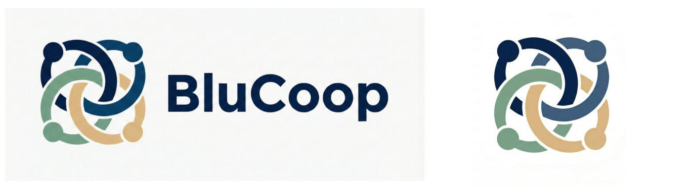

*Fonte: Elaborado pelos próprios autores.*

## 7 Estrutura Organizacional

A BluCoop é uma cooperativa de crédito composta por uma matriz localizada em Blumenau e cinco filiais regionais. Sua organização combina setores administrativos, operacionais e de tecnologia da informação, garantindo suporte eficiente às atividades financeiras e ao atendimento dos cooperados.

### 7.1 Estrutura - Matriz

A matriz da BluCoop concentra as decisões estratégicas, a governança corporativa e a gestão central da cooperativa. Sua estrutura organizacional é composta por níveis executivo e tático, garantindo alinhamento entre planejamento e operação.

- **Conselho Executivo:** No nível mais alto da organização, encontra-se o Conselho Executivo, responsável pela definição das diretrizes estratégicas, supervisão das atividades institucionais e garantia da conformidade com os objetivos da cooperativa. É composto por:
  - Presidente;
  - Vice-presidente;
  - Conselheiros.
- **Diretorias Executivas:** Abaixo do Conselho Executivo, a estrutura é segmentada em diretorias especializadas, cada uma responsável por uma área crítica da organização:
  - **Diretoria Financeira:** Responsável pela gestão financeira da cooperativa, incluindo planejamento orçamentário, controle de custos, contabilidade e análise de desempenho financeiro;
  - **Diretoria de Tecnologia:** Responsável pela infraestrutura de TI, segurança da informação, sistemas corporativos e suporte tecnológico às operações da BluCoop;
  - **Diretoria de Operações:** Responsável pela execução das atividades operacionais, padronização de processos e eficiência dos serviços prestados nas unidades.
- **Áreas Operacionais:** As diretorias são apoiadas por áreas operacionais que executam as atividades do dia a dia da cooperativa, as quais garantem o funcionamento da organização e o suporte às filiais, incluindo:
  - Atendimento;
  - Financeiro & Gestão de Fornecedores;
  - Suporte;
  - Tecnologia da Informação (TI).

Se faz importante destacar que a BluCoop adota um modelo de terceirização parcial de áreas estratégicas, com o objetivo de otimizar recursos, reduzir custos operacionais e acessar expertise especializada. As áreas terceirizadas incluem:

- Marketing;
- Jurídico;
- Recursos Humanos (RH).

Embora essas funções não sejam executadas integralmente por equipes internas, a cooperativa mantém o controle estratégico por meio de uma estrutura de gestão de fornecedores.

### 7.2 Estrutura - Filiais

As filiais da BluCoop desempenham papel fundamental na execução das atividades operacionais e no relacionamento direto com os cooperados. Diferentemente da matriz, que possui foco estratégico, as filiais são orientadas à execução, atendimento e suporte local.

A estrutura das filiais é padronizada, porém adaptável conforme o porte de cada unidade, garantindo equilíbrio entre eficiência operacional e controle de custos, incluindo as seguintes áreas:

- **Gestão:** Cada filial é liderada por um Gerente da Unidade, o qual é responsável por coordenar as atividades operacionais da filial, gerenciar a equipe, garantir o cumprimento das metas estabelecidas pela Matriz e atuar como elo entre a estratégia e a operação local;
- **Atendimento ao Cooperado:** Responsável pelo contato direto com os cooperados, prestação de serviços financeiros, abertura de contas, suporte e orientação;
- **Área Administrativa:** Responsável por rotinas internas, organização de documentos, apoio à gestão e controle de processos operacionais;
- **Suporte de TI:** Presente de forma reduzida, com foco em suporte básico aos equipamentos e usuários, enquanto demandas mais complexas são encaminhadas à equipe de TI da matriz.

Esse modelo permite que a cooperativa mantenha padronização nos processos, ao mesmo passo em que garante flexibilidade operacional nas diferentes localidades.

### 7.3 Modelo de Trabalho

A BluCoop adota um modelo de trabalho estruturado de forma híbrida na matriz e presencial nas filiais, buscando equilibrar flexibilidade, produtividade e qualidade no atendimento aos cooperados.

Na Matriz, localizada em Blumenau, o modelo de trabalho é híbrido para a maioria dos setores, permitindo que os colaboradores alternem entre atividades presenciais e remotas, exceto para o setor de Atendimento, onde, como nas filiais, o modelo de trabalho é 100% presencial, devido à natureza das atividades desempenhadas, que exigem contato direto com os cooperados.

Mesmo com modelos distintos, a BluCoop mantém forte integração entre matriz e filiais por meio de recursos tecnológicos, como:

- Utilização de VPN para acesso remoto seguro;
- Sistemas corporativos centralizados;
- Comunicação contínua entre equipes;
- Suporte técnico centralizado na matriz.

## 8 Estrutura Tecnológica

A estrutura tecnológica da BluCoop foi projetada para garantir alta disponibilidade, segurança da informação e integração entre as unidades, suportando tanto as operações presenciais quanto o trabalho remoto:

- A matriz concentra os principais servidores e serviços críticos;
- As filiais possuem infraestrutura local para suporte às operações;
- As unidades são interligadas por meio de enlaces seriais WAN, e colaboradores remotos se conectam via VPN.

Esse modelo permite maior controle, padronização e facilidade na gestão da infraestrutura.

### 8.1 Estrutura Tecnológica - Matriz

A matriz concentra os principais recursos tecnológicos da cooperativa, incluindo servidores e a maior parte dos equipamentos operacionais. A unidade possui 65 estações de trabalho, distribuídas entre os setores da seguinte forma:

- Conselho: 5
- Diretoria: 3
- Atendimento: 20
- Financeiro & Gestão de Fornecedores: 7
- Suporte: 10
- Tecnologia da Informação (TI): 20

A matriz também conta com três servidores principais, responsáveis pelos serviços críticos da rede:

- **Servidor 1:**
  - Serviço de DNS (resolução de nomes);
  - Sistema de telefonia PABX baseado em VoIP.
- **Servidor 2:**
  - Serviço de FTP para troca e armazenamento controlado de arquivos.
- **Servidor 3:**
  - Banco de dados central da cooperativa.

Esses servidores garantem o funcionamento dos sistemas internos e o armazenamento seguro das informações.

### 8.2 Estrutura Tecnológica - Filiais

As filiais possuem infraestrutura tecnológica proporcional ao seu porte, com foco na execução das operações locais. Cada unidade conta com:

- Equipamentos operacionais para atendimento e atividades administrativas;
- 1 servidor local, utilizado para suporte às operações da unidade e integração com a matriz.

Distribuição de equipamentos por unidade:

- Gaspar: 15 equipamentos + 1 servidor (16 máquinas);
- Timbó: 10 equipamentos + 1 servidor (11 máquinas);
- Indaial: 12 equipamentos + 1 servidor (13 máquinas);
- Pomerode: 10 equipamentos + 1 servidor (11 máquinas);
- Ascurra: 8 equipamentos + 1 servidor (9 máquinas).

A comunicação entre matriz e filiais é realizada por meio de enlaces seriais WAN.

## 9 Infraestrutura de Rede

### 9.1 Topologia de Rede

A escolha da topologia de rede é uma decisão estratégica que impacta diretamente o desempenho, a resiliência e os custos operacionais de uma organização. No caso da BluCoop, após análise das características da cooperativa, optou-se pela topologia estrela tanto na camada LAN de cada unidade quanto na camada WAN que interliga todas as unidades.

Na topologia estrela, todos os dispositivos de uma rede local se conectam a um ponto central de distribuição (switch) que é responsável por gerenciar e encaminhar o tráfego entre os equipamentos. Essa arquitetura apresenta vantagens significativas em ambientes corporativos:

- A falha de um único dispositivo não compromete os demais, pois cada equipamento possui seu próprio enlace dedicado com o switch central;
- A identificação e o isolamento de falhas tornam-se mais ágeis;
- A adição de novos dispositivos ocorre sem necessidade de reconfiguração da topologia existente, possibilitando escalabilidade à rede.

Cogitou-se também o uso de uma topologia em anel para a WAN, solução que oferece redundância de caminhos ao formar um circuito fechado entre as unidades, porém essa abordagem acarreta em maior complexidade no gerenciamento do roteamento e apresenta riscos de latência em cenários de falha, onde o tráfego é forçado a percorrer o anel em sentido oposto. Já a topologia em malha completa, foi descartada por exigir uma quantidade elevada de enlaces dedicados, sendo economicamente inviável para o porte da cooperativa. Assim, a estrela demonstrou ser a alternativa mais equilibrada entre custo, simplicidade operacional e adequação às necessidades da BluCoop.

### 9.2 Arquitetura da Rede

Para prototipar a rede da cooperativa, foi utilizado o sistema Cisco Packet Tracer.

**Figura 2 - Protótipo Completo da Rede no Cisco Packet Tracer**

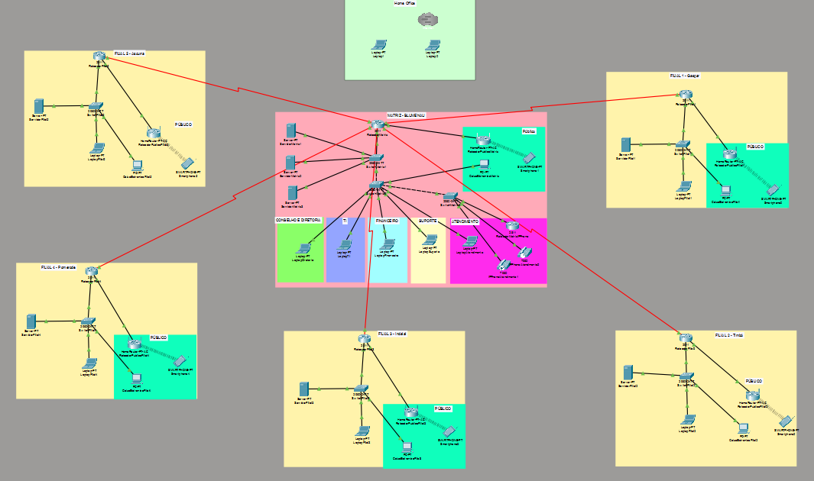

*Fonte: Elaborado pelos próprios autores.*

A rede da BluCoop é estruturada em dois níveis principais e complementares. O primeiro é a WAN, responsável por interligar a matriz às cinco filiais por meio de enlaces seriais, formando uma topologia estrela em nível macro, com a matriz de Blumenau atuando como ponto central da infraestrutura. O segundo nível é a LAN de cada unidade, composta por segmentos internos corporativos e um segmento público separado, voltado ao atendimento de cooperados e visitantes.

Esse modelo de dois níveis permite que a BluCoop centralize o gerenciamento e os serviços críticos na matriz, ao mesmo passo em que garante autonomia operacional às filiais para o atendimento local. A comunicação entre todos os pontos é realizada de forma transparente aos usuários finais, que acessam sistemas corporativos centralizados como se estivessem na mesma rede local.

O modelo lógico de referência adotado é o TCP/IP, estruturado sobre o modelo OSI, garantindo interoperabilidade e comunicação ponta a ponta entre todas as unidades. Esse modelo assegura que a cooperativa disponha de comunicação confiável e escalável para o funcionamento contínuo de seus sistemas corporativos, como o banco de dados central e os serviços de telefonia VoIP.

### 9.3 Infraestrutura - Matriz

A matriz concentra os principais recursos tecnológicos da cooperativa e é o núcleo de toda a infraestrutura de rede. O roteamento central é realizado pelo RoteadorMatriz, que é responsável pelo encaminhamento do tráfego tanto na rede interna quanto nos enlaces seriais WAN com as filiais e no acesso remoto de colaboradores via VPN.

A camada de distribuição interna é composta por três switches:

- O SwitchMatriz1 conecta os servidores e atua como núcleo da rede interna;
- O SwitchMatriz2 distribui conectividade para os diferentes setores da matriz;
- Por fim, o SwitchMatriz3 atende especificamente o setor de Atendimento, que por suas características operacionais, demanda isolamento e priorização de tráfego de voz.

De forma complementar, a rede pública da matriz é provida por um roteador (RoteadorPublicoMatriz), que oferece acesso Wi-Fi isolado da rede corporativa para cooperados e visitantes. A rede de telefonia IP conta com um roteador dedicado, o RoteadorMatrizIPPhone, responsável pelo gerenciamento do tráfego de voz sobre IP (VoIP), integrando-se ao serviço de PABX hospedado no ServidorMatriz1.

**Figura 3 - Protótipo da Rede da Matriz**

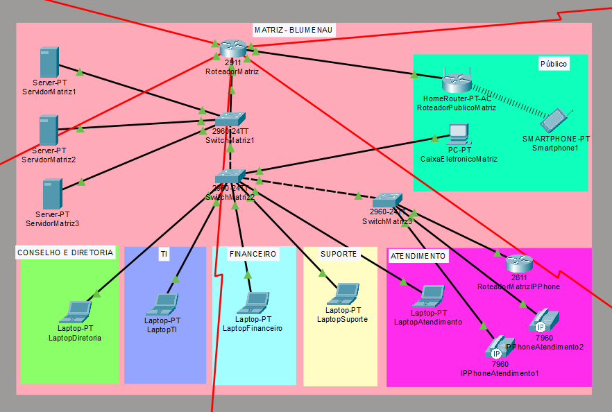

*Fonte: Elaborado pelos próprios autores.*

A matriz opera com três servidores, cada qual com responsabilidades bem definidas dentro da infraestrutura da cooperativa:

- ServidorMatriz1 hospeda o serviço de DNS, configurado com os registros de domínio interno da cooperativa, e o sistema de telefonia PABX baseado em VoIP, que centraliza as comunicações de voz de todas as unidades.
- ServidorMatriz2 provê o serviço de FTP, utilizado para a transferência e armazenamento controlado de arquivos entre as unidades da cooperativa.
- ServidorMatriz3 abriga o banco de dados central da BluCoop, repositório das informações mais sensíveis da instituição, incluindo dados financeiros e cadastrais dos cooperados.

Todos os três servidores estão conectados ao SwitchMatriz1, garantindo acesso centralizado de baixa latência pelos demais setores e pelas filiais, que os acessam remotamente através dos enlaces seriais WAN estabelecidos com a matriz.

### 9.4 Infraestrutura - Filiais

Todas as cinco filiais seguem um modelo padronizado de infraestrutura, dimensionado proporcionalmente ao porte de cada unidade. Essa padronização é uma decisão estratégica, pois facilita o suporte remoto pela equipe de TI da matriz, reduz o tempo de resposta a incidentes, simplifica a implantação de novas configurações e assegura que as políticas de segurança sejam aplicadas de maneira uniforme em toda a cooperativa.

**Figura 4 - Protótipo da Rede da Filial 1**

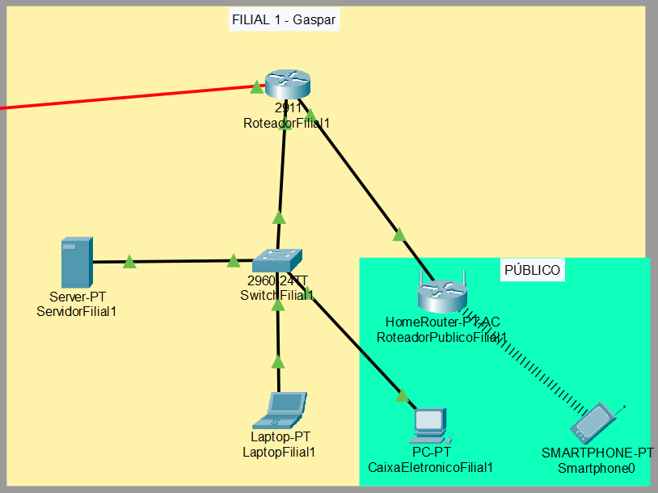

*Fonte: Elaborado pelos próprios autores.*

Cada filial é estruturada com um roteador que gerencia o roteamento local e mantém o enlace serial WAN ativo com a matriz. O switch de distribuição conecta os dispositivos operacionais locais. Cada filial conta também com um servidor dimensionado para suporte às operações locais e integração com os serviços centrais da matriz.

### 9.5 Serviços de Rede

#### 9.5.1 DNS

O serviço de DNS é hospedado no ServidorMatriz1 (IP 192.168.10.10) e é responsável pela resolução de nomes internos da cooperativa. Foram configurados três registros do tipo A:

```text
blucoop.com.br -> 192.168.10.10 (servidor DNS/PABX)
ftp.blucoop.com.br -> 192.168.10.11 (servidor FTP)
db.blucoop.com.br -> 192.168.10.12 (banco de dados)
```

Todos os dispositivos da rede apontam para esse servidor como DNS primário, inclusive os equipamentos das filiais, que o acessam através do enlace serial WAN. Isso garante resolução de nomes centralizada e uniforme em toda a cooperativa.

#### 9.5.2 DHCP

O serviço de DHCP está configurado em todos os servidores da rede, tanto nos três servidores da matriz quanto nos servidores locais de cada filial. Essa decisão garante que cada unidade seja capaz de distribuir endereçamento IP de forma autônoma, sem depender exclusivamente da matriz para tal.

Na matriz, o pool configurado no ServidorMatriz1 (192.168.10.10) atende os dispositivos da rede corporativa local com os seguintes parâmetros:

```text
Faixa de IPs: a partir de 192.168.10.20
Gateway padrão: 192.168.10.1 (RoteadorMatriz)
Servidor DNS: 192.168.10.10
Máscara: 255.255.255.0
```

Nas filiais, o servidor local de cada unidade assume essa responsabilidade para os dispositivos de sua própria subnet. O ServidorFilial1 de Gaspar, por exemplo, distribui endereços na faixa 192.168.11.0/24, com gateway 192.168.11.1 (RoteadorFilial1) e DNS apontando para o ServidorMatriz1 (192.168.10.10), acessado via enlace serial WAN.

Essa arquitetura distribuída de DHCP traz duas vantagens principais: resiliência, pois uma eventual indisponibilidade da matriz não impede que os dispositivos de uma filial recebam endereçamento; e eficiência, pois o tráfego de concessão de IP permanece local em cada unidade, sem precisar atravessar o enlace WAN.

**Figura 5 - Endereçamento de IPs dos Servidores Matriz**

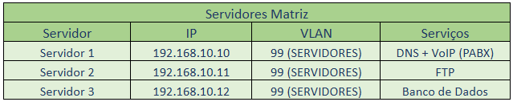

*Fonte: Elaborado pelos próprios autores.*

**Figura 6 - Endereçamento de IPs dos Servidores Filiais**

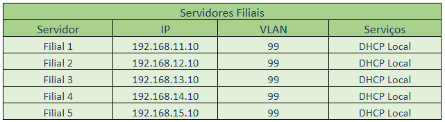

*Fonte: Elaborado pelos próprios autores.*

#### 9.5.3 FTP

O serviço de FTP é provido pelo ServidorMatriz2 (192.168.10.11), acessível pelo nome ftp.blucoop.com.br. Ele é utilizado para a transferência e o armazenamento controlado de arquivos entre as unidades da cooperativa. As filiais acessam esse serviço remotamente através dos enlaces seriais WAN estabelecidos com a matriz, garantindo que a troca de arquivos ocorra de forma segura e centralizada.

#### 9.5.4 VoIP e PABX

O sistema de telefonia IP (VoIP) é centralizado no ServidorMatriz1, que hospeda o serviço de PABX virtual. O tráfego de voz é gerenciado pelo RoteadorMatrizIPPhone, que opera na mesma subnet corporativa (192.168.10.0/24) e é responsável pelo roteamento prioritário dos pacotes de voz.

Os telefones IP estão registrados nesse PABX, como pode ser observado pelo IPPhoneAtendimento1 com ramal 1002 e IP 192.168.10.21. O setor de Atendimento conta com um switch dedicado (SwitchMatriz3) justamente para garantir isolamento e priorização do tráfego de voz.

Para viabilizar o funcionamento dos telefones IP, foi necessário realizar uma série de configurações na infraestrutura de rede. Primeiramente, no SwitchMatriz3, foram configuradas as portas às quais os telefones IP estão conectados (FastEthernet 0/4 e 0/5) com suporte à VLAN de voz, permitindo que o switch reconheça e priorize o tráfego de telefonia nessas portas.

No RoteadorMatrizIPPhone, foi configurada a interface FastEthernet com o endereço IP 192.168.10.2 dentro da sub-rede corporativa, e em seguida foi habilitado o serviço de telefonia (CME - Call Manager Express), definindo a capacidade máxima de ramais e aparelhos suportados, bem como o endereço de origem do serviço de telefonia na porta 2000. Cada ramal foi então registrado individualmente com seu respectivo número de discagem, e a atribuição automática dos aparelhos aos ramais foi ativada.

#### 9.5.5 WAN

A interligação entre a matriz e as cinco filiais é realizada por meio de enlaces seriais WAN, com o RoteadorMatriz concentrando todas as conexões e formando uma topologia estrela em nível macro, com Blumenau atuando como ponto central da infraestrutura. Cada filial possui um roteador local que mantém o enlace serial ativo com a matriz, garantindo comunicação contínua entre as unidades.

Os endereços utilizados nos enlaces seguem sub-redes /24 dedicadas para cada par matriz-filial:

**Figura 7 - Endereçamento de IPs WAN**

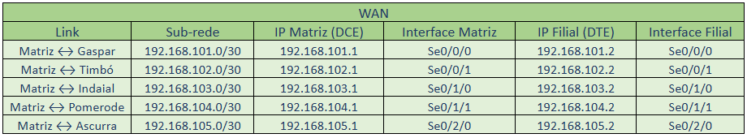

*Fonte: Elaborado pelos próprios autores.*

Através desses enlaces, os dispositivos das filiais acessam de forma transparente os serviços centrais hospedados na matriz (como DNS, FTP e banco de dados) como se estivessem na mesma rede local.

#### 9.5.6 LAN Corporativa e Rede Pública (NAT)

Cada unidade opera com duas redes logicamente separadas:

- **Rede corporativa (LAN):** destinada aos colaboradores, servidores e dispositivos operacionais. Na matriz, opera na faixa 192.168.10.0/24; nas filiais, cada unidade possui sua própria subnet (ex: Gaspar em 192.168.11.0/24). Essa separação garante que o tráfego interno seja isolado e controlado;
- **Rede pública (Wi-Fi):** provida por um roteador dedicado (RoteadorPublicoMatriz / RoteadorPublicoFilial) que opera na faixa 172.16.10.0/24 (LAN do roteador público), com acesso à internet via 192.168.110.0/24. Essa rede é fisicamente e logicamente separada da corporativa, destinada exclusivamente a cooperados e visitantes. O roteador público realiza NAT, traduzindo os endereços privados dessa rede para o IP da interface de saída.

**Figura 7 - Endereçamento de IPs LAN**

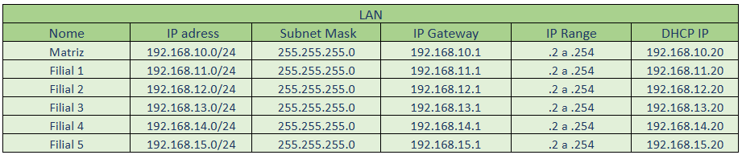

*Fonte: Elaborado pelos próprios autores.*

**Figura 8 - Endereçamento de IPs Wi-fi Público**

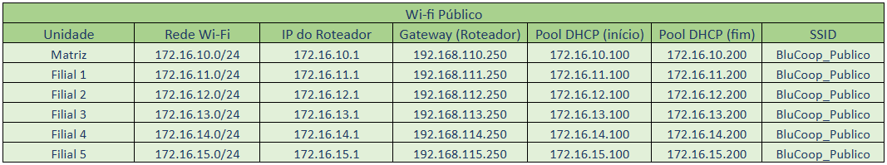

*Fonte: Elaborado pelos próprios autores.*

### 9.6 Equipamentos

Para garantir o pleno funcionamento da infraestrutura tecnológica, foram levantados e especificados todos os equipamentos necessários para a operação da BluCoop, contemplando tanto a matriz quanto as filiais. A seguir, são apresentadas as planilhas de inventário com a relação completa de equipamentos, fabricantes, quantidades e valores estimados.

**Figura 9 - Planilha de Inventário de Equipamentos - Matriz**

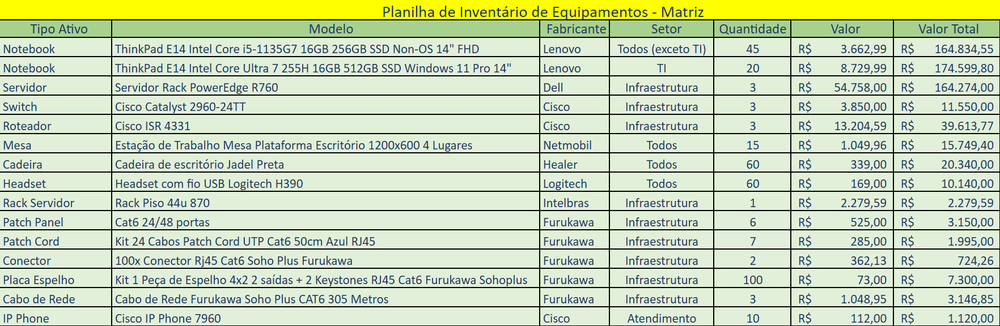

*Fonte: Elaborado pelos próprios autores.*

**Figura 10 - Planilha de Inventário de Equipamentos - Filial 1**

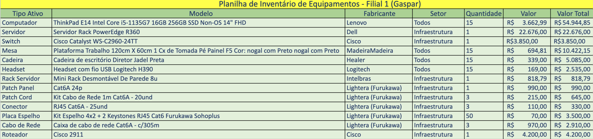

*Fonte: Elaborado pelos próprios autores.*

### 9.7 Planilha de Cálculo de Links

Para garantir que a infraestrutura de rede da BluCoop suporte adequadamente as operações do dia a dia, foi realizado o dimensionamento da largura de banda necessária em cada unidade da cooperativa. O cálculo considera o número de usuários por unidade e os requisitos individuais de cada aplicação corporativa utilizada.

A partir desses dados, foram obtidos dois valores distintos por unidade: o total de banda demandado pelas aplicações e o total necessário para o link de internet, que serve de base para a contratação dos enlaces WAN. A matriz de Blumenau, por concentrar o maior número de colaboradores e os serviços críticos da cooperativa, apresenta naturalmente a maior demanda, já as filiais foram dimensionadas proporcionalmente ao seu porte. O cenário de Home Office também foi contemplado, de forma a assegurar conectividade adequada para os colaboradores em caso de trabalho remoto. Os valores completos por unidade estão consolidados na planilha a seguir.

**Figura 11 - Planilha de Cálculo de Links de Dados e Internet**

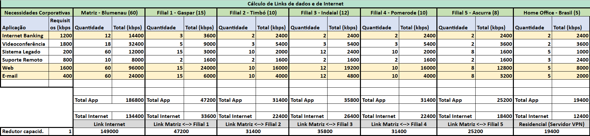

*Fonte: Elaborado pelos próprios autores.*

## 10 Testes

### 10.1 Servidor de FTP

Na imagem abaixo é possível visualizar o envio de um arquivo de uma máquina para o servidor de FTP da matriz.

**Figura 12 - Teste de Envio de Arquivo de Filial para Matriz**

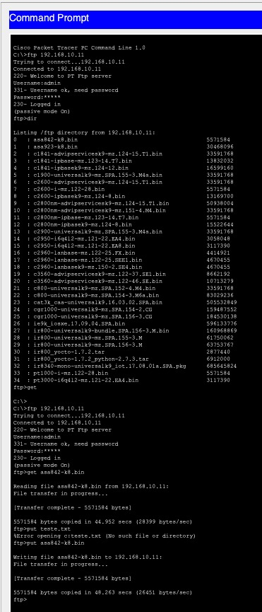

*Fonte: Elaborado pelos próprios autores.*

### 10.2 IPPhones

Na imagem abaixo, é possível verificar o IPPhone 1002 ligando para o 1001.

**Figura 13 - IPPhone 1002 em Conexão com o IPPhone 1001**

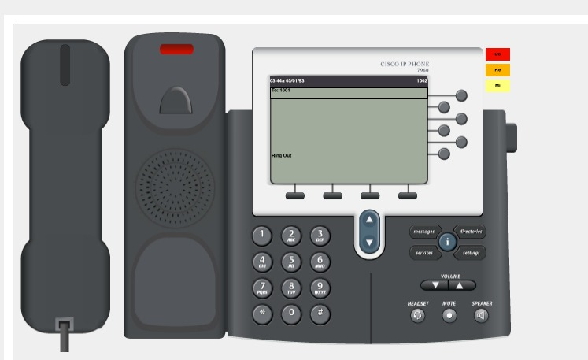

*Fonte: Elaborado pelos próprios autores.*

Já na imagem abaixo, é possível verificar o IPPhone 1001 recebendo a ligação do IPPhone 1002.

**Figura 14 - IPPhone 1001 Recebendo a Ligação do 1002**

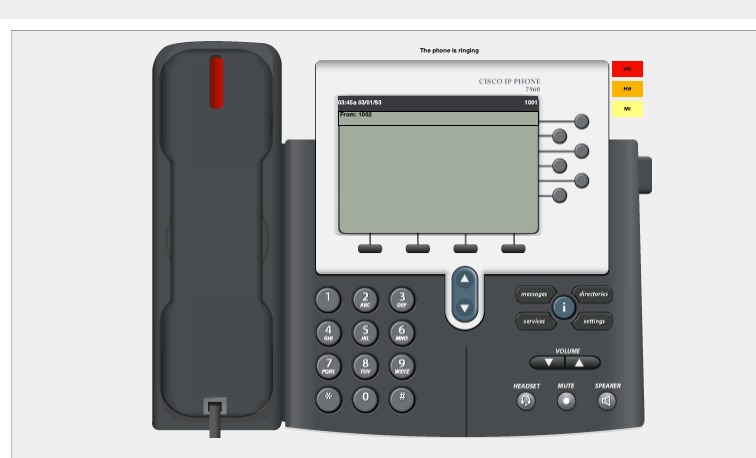

*Fonte: Elaborado pelos próprios autores.*

Na próxima imagem, é possível visualizar a ligação entre os dois IPPhones enfim realizada.

**Figura 15 - Conexão entre IPPhones 1001 e 1002 realizada**

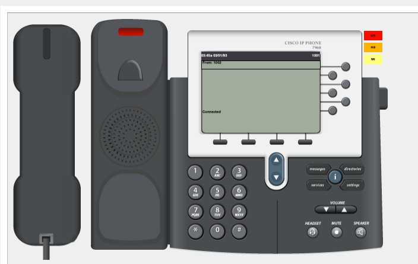

*Fonte: Elaborado pelos próprios autores.*

### 10.3 Acesso Web

Na imagem abaixo está demonstrado o acesso à uma página web que está no servidor WEB utilizando o nome configurado no servidor de DNS.

**Figura 16 - Acesso Web**


*Fonte: Elaborado pelos próprios autores.*

### 10.4 DHCP

Na imagem a seguir é possível visualizar a entrega do IP por meio de DHCP para uma máquina na matriz.

**Figura 17 - Entrega de IP através de DHCP**

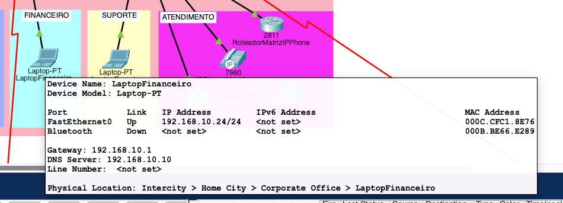

*Fonte: Elaborado pelos próprios autores.*
