# Etapa 2 - Preparação do Ambiente em Nuvem e Virtualização Local

A presente seção integra a segunda etapa do projeto de infraestrutura de rede da cooperativa BluCoop, na qual foram implementados e configurados diversos serviços essenciais para o funcionamento da infraestrutura tecnológica da cooperativa, contemplando tanto ambientes em nuvem quanto ambientes virtualizados localmente. O objetivo desta etapa foi garantir a disponibilidade de serviços fundamentais de rede, armazenamento, processamento e comunicação, assegurando integração entre sistemas, escalabilidade e segurança operacional. Para isso, foram configurados serviços como DHCP, AD (Active Directory), DNS, servidor web com Apache, API em Node.js, banco de dados PostgreSQL, servidor FTP e sistema de arquivos compartilhado (EFS), além de servidores locais em ambiente virtualizado.

## 11.1 AMBIENTE LOCAL - VIRTUALIZAÇÃO ON-PREMISE

### 11.1.1 SERVIÇO DHCP

A implementação do serviço de DHCP foi realizada em ambiente virtualizado utilizando o software de virtualização Oracle VirtualBox, com o objetivo de simular uma rede local e automatizar a atribuição de endereços IP. O ambiente foi composto por duas máquinas virtuais:

- Um servidor DHCP com Ubuntu Server 22.04: Responsável por atribuir endereços IP automaticamente aos dispositivos da rede;
- Um cliente com Ubuntu Desktop 22.04: Máquina cliente que recebe a configuração de rede via DHCP.

Ambas as máquinas foram conectadas por meio de uma rede interna, simulando uma LAN isolada.

**Figura 18 - Exibição das Configurações da VM Servidor-DHCP no VirtualBox**

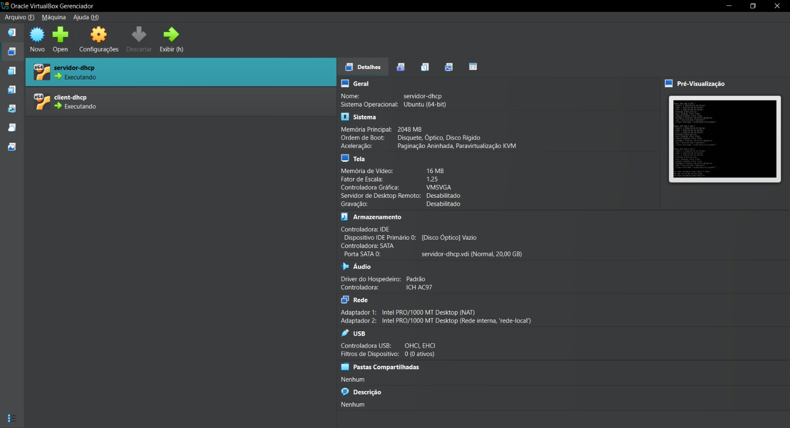

*Fonte: Elaborado pelos próprios autores.*

**Figura 19 - Exibição das Configurações da VM Cliente no VirtualBox**

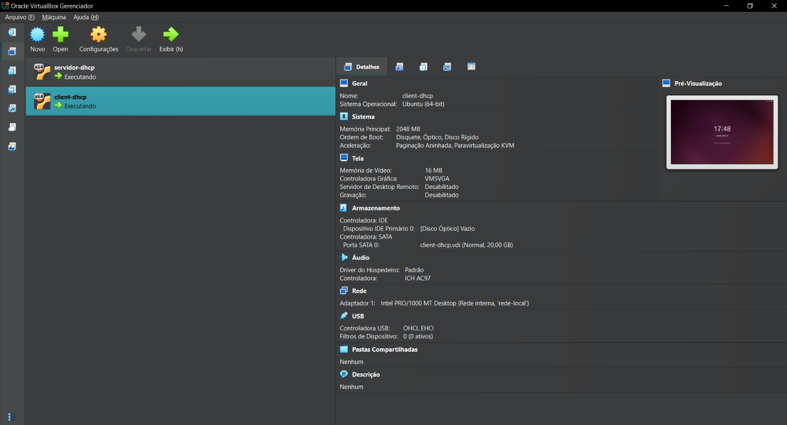

*Fonte: Elaborado pelos próprios autores.*

O servidor foi configurado com endereço IP estático 192.168.1.1 e utilizou o serviço isc-dhcp-server para distribuição automática de endereços na faixa de 192.168.1.100 a 192.168.1.200. Foram definidos parâmetros essenciais como gateway e servidores DNS, permitindo que o cliente recebesse automaticamente todas as configurações de rede necessárias.

**Figura 20 - Exibição das Interfaces de Rede após Comando "ip a" Executado no Servidor**

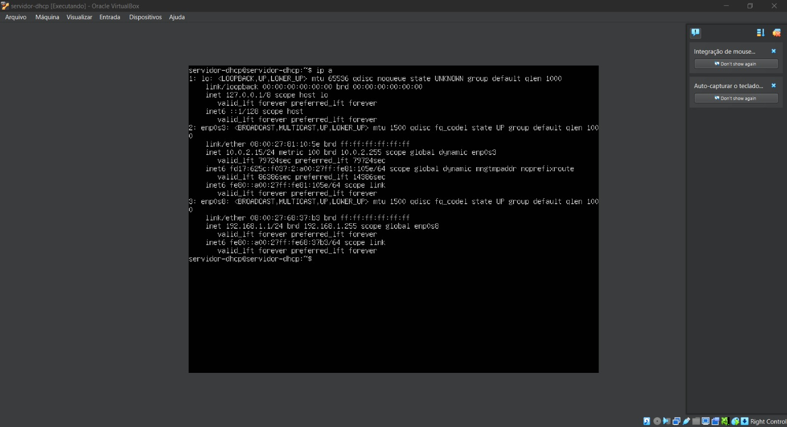

*Fonte: Elaborado pelos próprios autores.*

**Figura 21 - Configuração do Netplan no Servidor com DHCP na Interface enp0s3 e IP Estático na enp0s8**

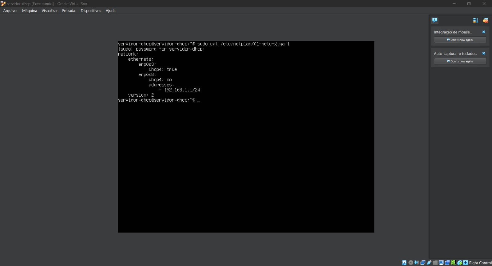

*Fonte: Elaborado pelos próprios autores.*

**Figura 22 - Configuração do DHCP**

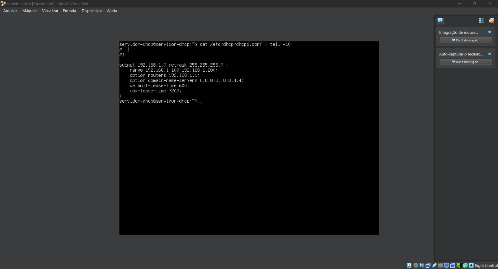

*Fonte: Elaborado pelos próprios autores.*

**Figura 23 - Configuração da Interface de Escuta do DHCP**

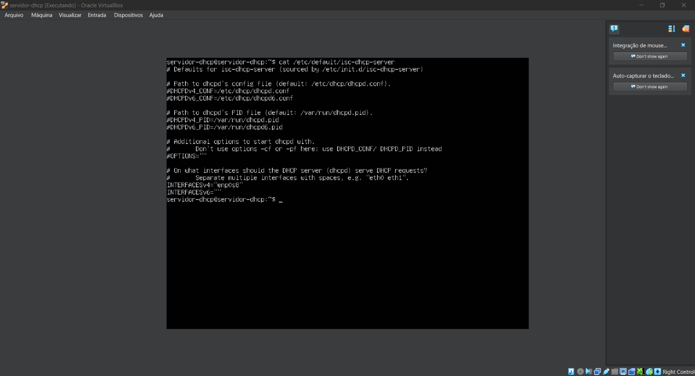

*Fonte: Elaborado pelos próprios autores.*

Os testes realizados confirmaram o correto funcionamento do serviço, com o cliente obtendo IP dinamicamente e estabelecendo comunicação com o servidor sem perda de pacotes, conforme é possível visualizar nas imagens a seguir.

**Figura 24 - Cliente Obtendo Endereço IP Automaticamente via DHCP na Interface enp0s3**

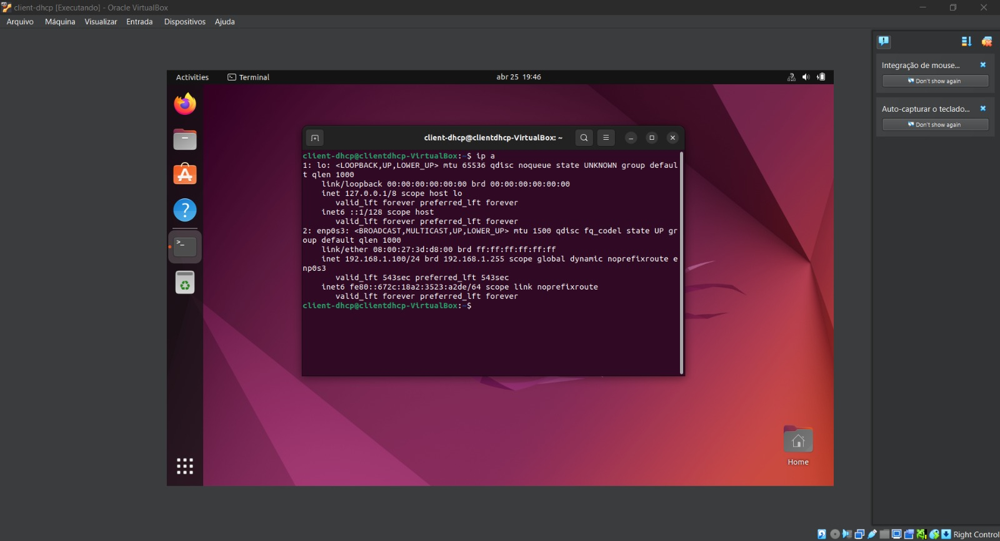

*Fonte: Elaborado pelos próprios autores.*

**Figura 25 - Teste de Conectividade: Comunicação entre Cliente e Servidor sem Perda de Pacotes**

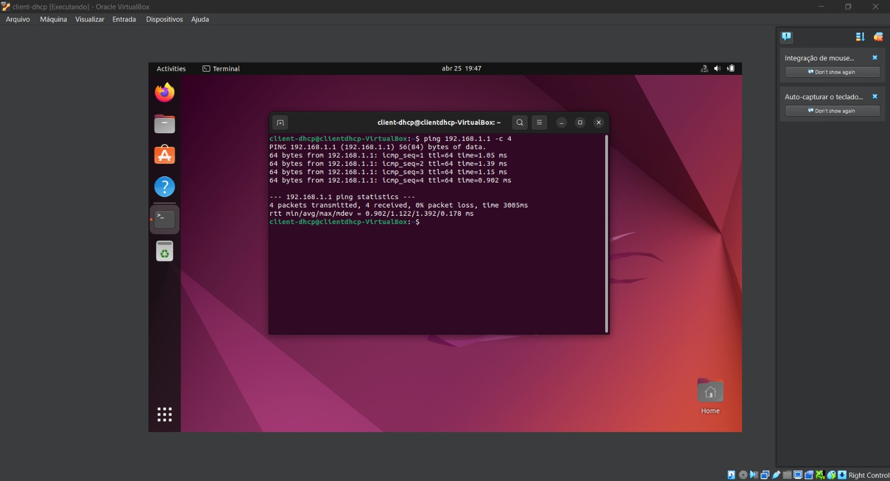

*Fonte: Elaborado pelos próprios autores.*

### 11.1.2 ACTIVE DIRECTORY (AD)

O Active Directory (AD) é um serviço de diretório desenvolvido pela Microsoft que centraliza o gerenciamento de identidades, autenticação e controle de acesso em ambientes corporativos. Para a BluCoop, sua adoção teve como objetivo unificar a gestão de usuários e recursos de rede em um único domínio, garantindo que cada colaborador acesse apenas os sistemas e informações compatíveis com sua função dentro da cooperativa.

A solução foi implementada em ambiente virtualizado com VirtualBox, foram criadas duas máquinas virtuais. A primeira, denominada BluCoop_AD, executa o Windows Server 2019 e atua como servidor do domínio, tendo sido nela instalado e configurado o serviço AD DS, com o domínio blucoop.local, DNS integrado e IP fixo (192.168.0.77). A segunda, denominada BluCoop-Cliente, executa o Windows 10 Pro e representa uma estação de trabalho da cooperativa, sendo utilizada para validar o ingresso ao domínio e a correta aplicação das políticas configuradas no servidor. Ambas as máquinas foram configuradas em modo bridge, permitindo comunicação direta entre si e com a rede local.

**Figura 26 - Exibição das Configurações da VM BluCoop_AD no VirtualBox**

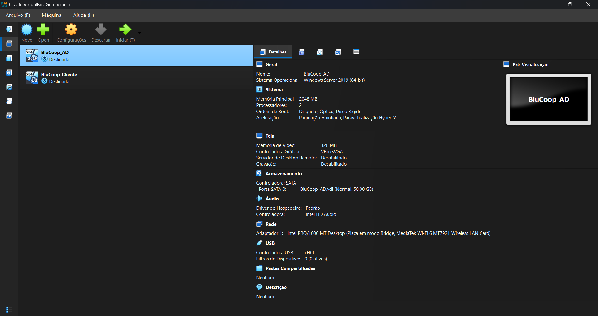

*Fonte: Elaborado pelos próprios autores.*

**Figura 27 - Exibição das Configurações da VM Cliente no VirtualBox**

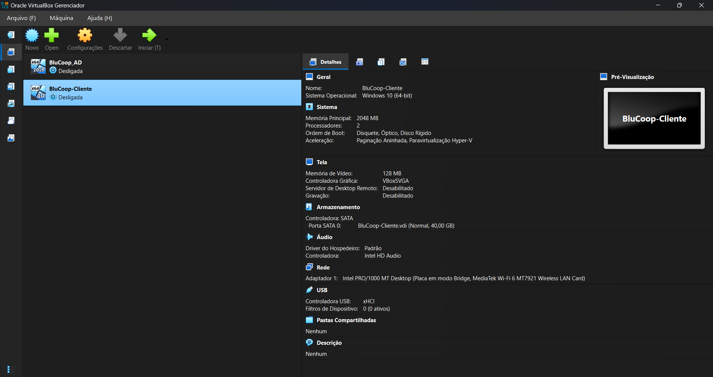

*Fonte: Elaborado pelos próprios autores.*

**Figura 28 - Comando "ipconfig" na VM Servidor (BluCoop_AD)**

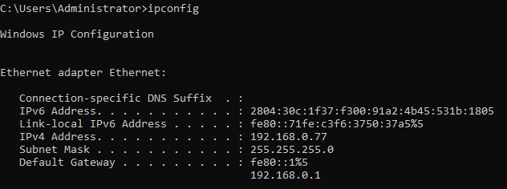

*Fonte: Elaborado pelos próprios autores.*

A organização dos objetos no diretório foi estruturada por meio de Unidades Organizacionais (OUs), que refletem a hierarquia funcional da cooperativa. Dentro da OU raiz BluCoop, foram criadas cinco unidades correspondentes aos departamentos da instituição: TI, Atendimento, Financeiro, Suporte e Diretoria. Essa segmentação permite aplicar políticas e permissões de forma granular, garantindo que cada área opere com os recursos e restrições adequados ao seu perfil de trabalho.

**Figura 29 - Estrutura Organizacional: OUs**

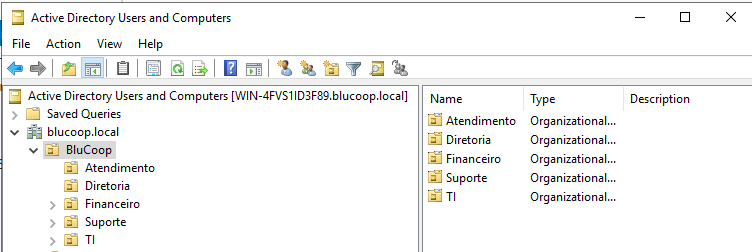

*Fonte: Elaborado pelos próprios autores.*

Para facilitar o gerenciamento de permissões em escala, foram criados grupos de segurança associados a cada departamento: GRP_TI, GRP_Atendimento, GRP_Financeiro, GRP_Suporte e GRP_Diretoria. Cada grupo reúne os usuários da respectiva área, permitindo que políticas de acesso sejam atribuídas ao grupo como um todo, em vez de individualmente a cada conta. Essa abordagem reduz o esforço administrativo e minimiza o risco de configurações inconsistentes no ambiente.

**Figura 30 - Grupos de Segurança Criados**

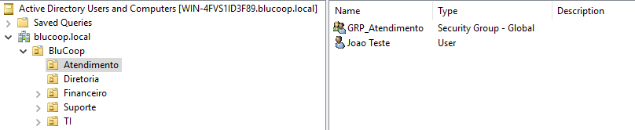

*Fonte: Elaborado pelos próprios autores.*

**Figura 31 - Exibição dos Grupos de Segurança Criados no Painel de Comando**

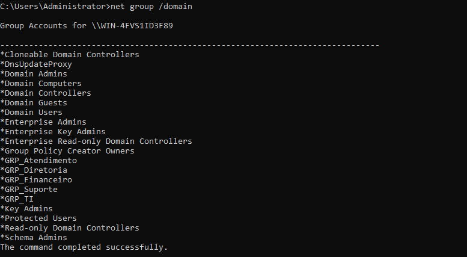

*Fonte: Elaborado pelos próprios autores.*

**Figura 32 - Exibição dos Usuários Criados no Painel de Comando**

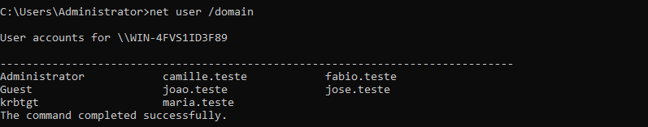

*Fonte: Elaborado pelos próprios autores.*

Foram também criadas Group Policy Objects (GPOs), as quais foram utilizadas para aplicar configurações padronizadas nos computadores e usuários do domínio. No contexto do projeto, GPOs foram configuradas em caráter de validação funcional, com o objetivo de verificar a correta propagação de políticas pelo ambiente. Esse mecanismo, em um cenário real de produção, seria utilizado para definir configurações de segurança, restrições de acesso a funcionalidades do sistema operacional e padrões de ambiente de trabalho para cada departamento da cooperativa.

**Figura 33 - GPOs: Bloquear_Painel_de_Controle**

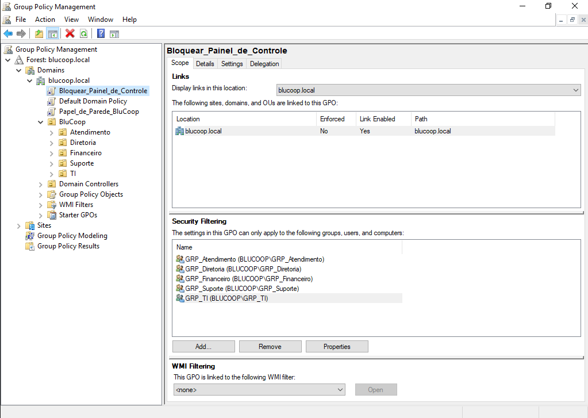

*Fonte: Elaborado pelos próprios autores.*

**Figura 34 - GPOs: Papel_de_Parede_BluCoop**

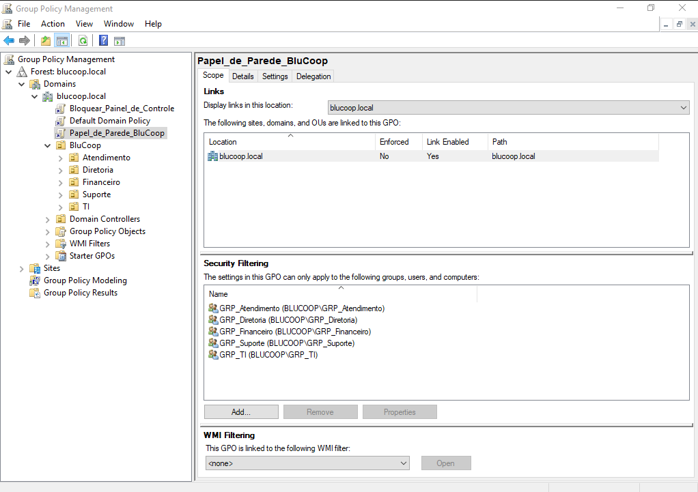

*Fonte: Elaborado pelos próprios autores.*

Para validar o funcionamento do ambiente, a estação de trabalho (máquina cliente) foi configurada para ingressar no domínio blucoop.local. O processo envolveu o apontamento do DNS da máquina cliente para o servidor AD e a autenticação com credenciais administrativas do domínio. Após o ingresso bem-sucedido, foi possível confirmar que os usuários cadastrados no diretório conseguiam autenticar-se na estação e que as políticas definidas no servidor eram aplicadas corretamente, validando a integridade da configuração realizada.

**Figura 35 - Teste VM Cliente: Alteração do Papel de Parede**


*Fonte: Elaborado pelos próprios autores.*

**Figura 36 - Teste VM Cliente: Bloqueio do Painel de Controle**

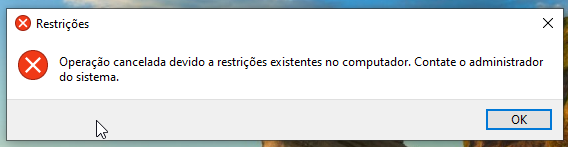

*Fonte: Elaborado pelos próprios autores.*

## 11.2 AMBIENTE EM NUVEM

### 11.2.1 DOMAIN NAME SYSTEM (DNS)

Para viabilizar o acesso público à infraestrutura web da BluCoop, foi configurado um conjunto de serviços gerenciados da Amazon Web Services (AWS) que integra resolução de nomes de domínio, distribuição de conteúdo e criptografia de comunicação. O domínio blucoop.click foi registrado e vinculado a essa arquitetura, permitindo que usuários acessem os serviços da cooperativa por meio de um endereço web seguro e de fácil memorização. A arquitetura adotada segue o seguinte fluxo de requisição: o usuário digita o endereço no navegador, o DNS resolve o nome para um ponto de distribuição na nuvem, que por sua vez encaminha a requisição ao servidor de origem. Esse modelo, além de melhorar o desempenho, adiciona camadas de segurança e disponibilidade ao ambiente. O serviço de DNS foi configurado utilizando o Amazon Route 53, responsável por traduzir o nome de domínio blucoop.click em endereços de rede que os sistemas conseguem processar. Foram criados registros do tipo A e AAAA, responsáveis pela resolução de endereços IPv4 e IPv6, respectivamente, apontando para a distribuição de conteúdo configurada no CloudFront. Além desses, os registros padrão de NS (Name Server) e SOA (Start of Authority), gerenciados automaticamente pela AWS, compõem a zona hospedada do domínio. O uso de registros do tipo Alias permite que os registros A e AAAA apontem diretamente para recursos da AWS sem a necessidade de um endereço IP fixo, tornando a configuração mais resiliente a mudanças na infraestrutura.

**Figura 37 - Configuração do DNS**

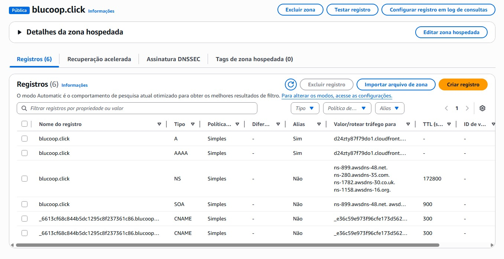

*Fonte: Elaborado pelos próprios autores.*

Para garantir a segurança das comunicações entre os usuários e os serviços da BluCoop, foi emitido um certificado SSL público por meio do AWS Certificate Manager (ACM). O certificado está associado ao domínio blucoop.click e foi validado via DNS,

processo no qual um registro CNAME específico é inserido na zona hospedada do Route 53 para comprovar a propriedade do domínio junto à autoridade certificadora. Com o certificado ativo, todas as requisições realizadas via HTTP são automaticamente redirecionadas para HTTPS, assegurando que os dados trafeguem de forma criptografada. Essa configuração está em conformidade com as boas práticas de segurança em aplicações web e é essencial para proteger informações sensíveis dos cooperados.

**Figura 38 - Configuração do Certificado (ACM)**

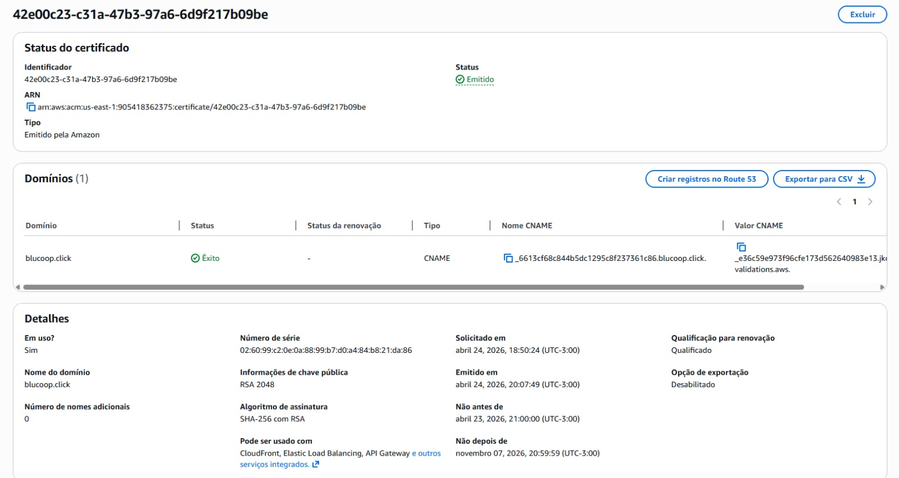

*Fonte: Elaborado pelos próprios autores.*

O Amazon CloudFront atua como uma camada intermediária entre o usuário e o servidor de origem, funcionando como uma Content Delivery Network (CDN). Ao receber uma requisição, o CloudFront pode servir o conteúdo a partir de pontos de presença geograficamente distribuídos, reduzindo a latência e melhorando a experiência de acesso. Para a BluCoop, foi criada uma distribuição vinculada ao domínio personalizado blucoop.click, com o certificado SSL emitido pelo ACM associado a ela.

**Figura 39 - Tela de Exibição do CloudFront**

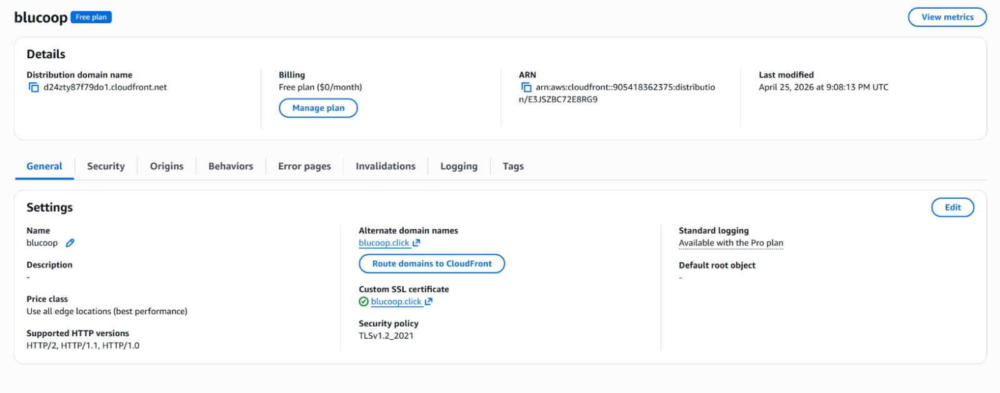

*Fonte: Elaborado pelos próprios autores.*

Foram também configuradas regras de comportamento (behaviors) que determinam como o CloudFront trata cada tipo de requisição:

1. Path pattern: /api/*
- Origin: meusite.s3.amazonaws.com-modj786yfo5
- Viewer protocol policy: Redirect HTTP to HTTPS
- Cache policy: Managed-CachingDisabled
- Origin request policy: Managed-AllViewer
2. Path pattern: Default (*)
- Origin: meusite.s3.amazonaws.com-modj786yfo5
- Viewer protocol policy: Redirect HTTP to HTTPS
- Cache policy: Managed-CachingOptimized
Requisições destinadas à API da aplicação seguem uma política sem cache, garantindo que os dados retornados sejam sempre atuais. Já as demais requisições utilizam uma política de cache otimizado, o que reduz a carga sobre o servidor de origem e melhora o tempo de resposta para os usuários.

**Figura 40 - Regras de Comportamento**

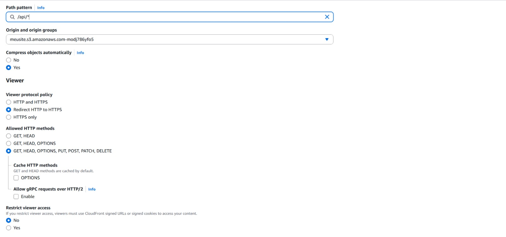

*Fonte: Elaborado pelos próprios autores.*

O servidor de origem da distribuição é uma instância EC2 da AWS, que processa as requisições encaminhadas pelo CloudFront e retorna as respostas correspondentes. A comunicação entre o CloudFront e a instância EC2 ocorre via protocolo HTTP na porta 80, de forma interna à infraestrutura da AWS, enquanto a comunicação com o usuário final é sempre realizada de forma criptografada via HTTPS, conforme definido nas políticas de segurança da distribuição.

**Figura 41 - Configuração da Origin**

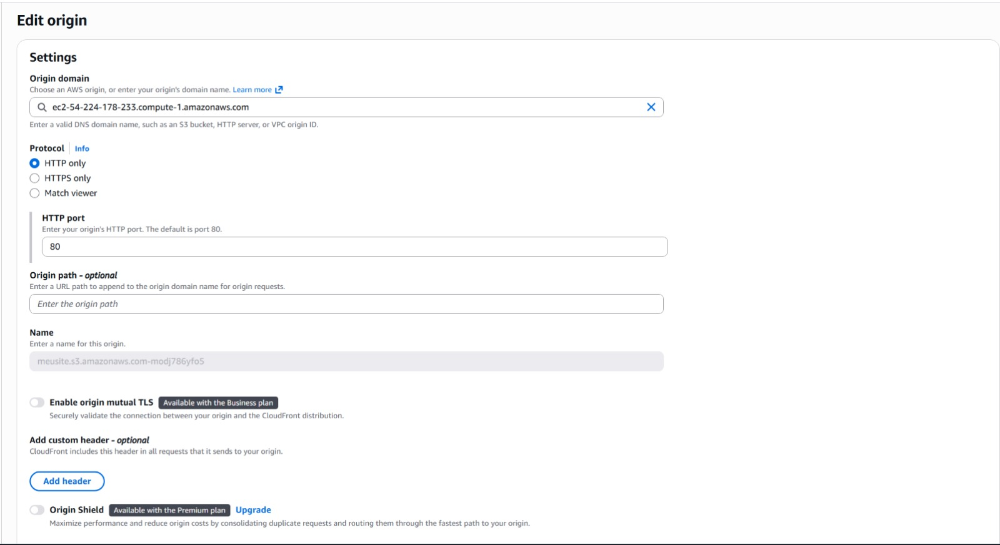

*Fonte: Elaborado pelos próprios autores.*

Por fim, a integração entre Route 53, ACM e CloudFront proporciona um ambiente seguro, com DNS gerenciado, comunicações criptografadas e distribuição otimizada de conteúdo.

### 11.2.2 SERVIDOR WEB E API

O servidor web foi implementado em uma instância EC2 (Elastic Compute Cloud) na AWS, com o objetivo de hospedar o frontend da aplicação e disponibilizar uma API para integração com o banco de dados. A configuração adotada buscou atender aos requisitos de baixo custo e escalabilidade, sendo adequada para um ambiente de prova de conceito (POC). A instância foi criada com as seguintes especificações:

- Sistema operacional (AMI): Ubuntu Noble 24.04
- Tipo da instância: t3.micro
- Nome da instância: Web Server
- VPC: VPC Web Server
- Endereçamento público:
  - IP: 54.224.178.233
  - DNS: ec2-54-224-178-233.compute-1.amazonaws.com

**Figura 42 - Configuração do Servidor Web na AWS**


*Fonte: Elaborado pelos próprios autores.*

No que se refere à segurança de rede, foi configurado um Security Group denominado web-server-security-group, com as seguintes regras de entrada:

- SSH (TCP/22) - acesso remoto administrativo;
- HTTP (TCP/80) - acesso ao servidor web;
- HTTPS (TCP/443) - acesso seguro ao servidor;
- ICMP (todos) - testes de conectividade.
Todas as regras foram liberadas para o bloco 0.0.0.0/0, o que permite acesso irrestrito. Ressalta-se que essa configuração foi mantida apenas para fins de POC, não sendo recomendada para ambientes de produção.

**Figura 43 - Exibição do Security Group e Regras de Entrada**


*Fonte: Elaborado pelos próprios autores.*

O acesso à instância foi realizado por meio do protocolo SSH (Secure Shell), utilizando chave privada previamente configurada:

```text
ssh -i "web-server.pem" ubuntu@ec2-54-224-178-233.compute-1.amazonaws.com
```

Esse método garante autenticação segura e criptografada entre o cliente e o servidor, sendo amplamente utilizado em ambientes Linux. Após o acesso à instância, foi realizada a instalação e configuração do servidor web Apache, responsável pela disponibilização do conteúdo estático da aplicação. Além disso, o

Apache foi configurado como proxy reverso, encaminhando requisições direcionadas ao caminho /api para uma aplicação backend desenvolvida em Node.js, executada localmente na porta 3000. A API foi construída utilizando o framework Express.js, com integração a um banco de dados PostgreSQL. Para a gestão de autenticação, foi implementado um sistema baseado em sessões, utilizando a biblioteca express-session, com controle de acesso às rotas por meio de middleware específico e persistência de sessão via cookies. A aplicação disponibiliza rotas para operações CRUD (Create, Read, Update e Delete) relacionadas às unidades da cooperativa, permitindo o gerenciamento completo dos dados. As configurações sensíveis, como credenciais de banco de dados e parâmetros de sessão, foram externalizadas por meio de variáveis de ambiente, definidas em arquivo próprio, garantindo maior segurança e flexibilidade. Para assegurar a execução contínua da aplicação em ambiente de produção, foi utilizado o gerenciador de processos PM2, responsável pela manutenção do serviço ativo e reinicialização automática em caso de falhas. Adicionalmente, foram realizados testes de validação da API por meio de requisições locais, confirmando o correto funcionamento da aplicação e sua integração com o banco de dados. URL funcional utilizada: https://blucoop.click/admin.

**Figura 44 - Tela de Login da Aplicação Web**

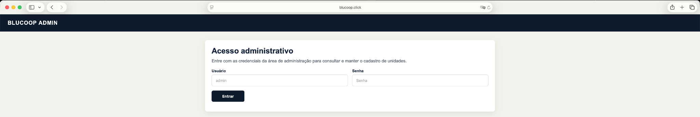

*Fonte: Elaborado pelos próprios autores.*

**Figura 45 - Tela Principal da Aplicação Web: Cadastro de Unidade (C)**


*Fonte: Elaborado pelos próprios autores.*

**Figura 46 - Tela Principal da Aplicação Web: Leitura e Atualização (R + U)**


*Fonte: Elaborado pelos próprios autores.*

**Figura 47 - Tela Principal da Aplicação Web: Exclusão de Unidade (D)**


*Fonte: Elaborado pelos próprios autores.*

Por fim, foi configurado o serviço CloudFront para distribuição de conteúdo, incluindo a criação de regras específicas para o encaminhamento de requisições dinâmicas da API (/api/*), com desativação de cache, suporte a múltiplos métodos HTTP (como POST, PUT e DELETE) e encaminhamento de cookies, garantindo o funcionamento adequado dos mecanismos de autenticação e atualização de dados.

**Figura 48 - Diagrama: Visualização Completa do Fluxo**

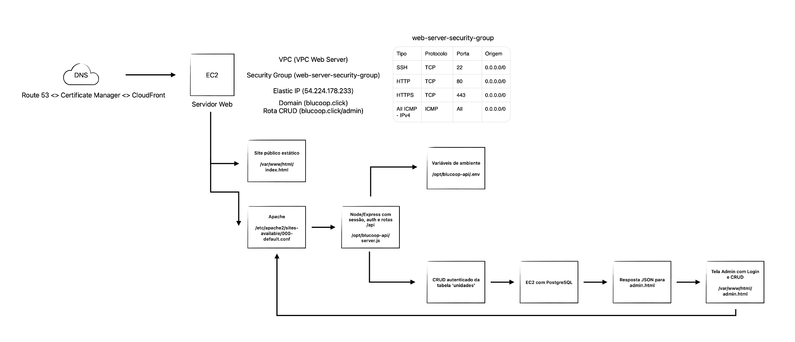

*Fonte: Elaborado pelos próprios autores.*

Por fim, foi configurado o serviço CloudFront para distribuição de conteúdo, incluindo a criação de regras específicas para o encaminhamento de requisições dinâmicas da API (/api/*), com desativação de cache, suporte a múltiplos métodos HTTP (como POST, PUT e DELETE) e encaminhamento de cookies, garantindo o funcionamento adequado dos mecanismos de autenticação e atualização de dados.

### 11.2.3 BANCO DE DADOS

Para suportar as operações da BluCoop, foi adotada uma solução de banco de dados relacional hospedada em infraestrutura de nuvem pública, utilizando os serviços da AWS. O banco de dados foi implantado em uma instância EC2 da AWS, denominada blucoop-database, executando o sistema operacional Ubuntu Server. A escolha pela instância do tipo t3.small se deu pelo equilíbrio entre custo e desempenho adequado ao volume de operações da cooperativa. Para garantir um endereço de rede estável e independente de reinicializações, foi atribuído um IP elástico à instância (52.73.138.177), assegurando que os sistemas que dependem dessa conexão não sejam impactados por eventuais interrupções de serviço.

**Figura 49 - Instância Criada na AWS**

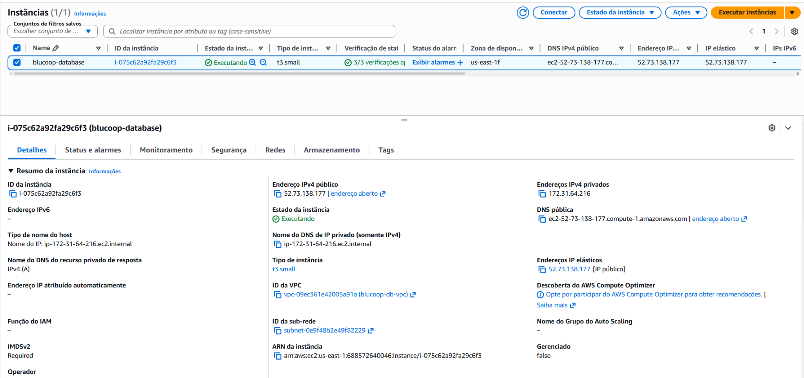

*Fonte: Elaborado pelos próprios autores.*

A segurança do ambiente foi configurada por meio de um grupo de segurança dedicado, denominado database-security-group, que define as regras de entrada e saída de tráfego da instância. Essa camada de controle garante que apenas conexões autorizadas consigam alcançar o servidor de banco de dados, restringindo o acesso a endereços e portas previamente definidos, em conformidade com as boas práticas de segurança em ambientes de nuvem.

**Figura 50 - Grupo de Segurança Dedicado**

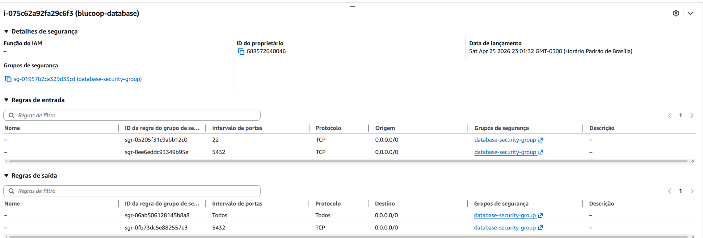

*Fonte: Elaborado pelos próprios autores.*

**Figura 51 - Regras de Entrada**

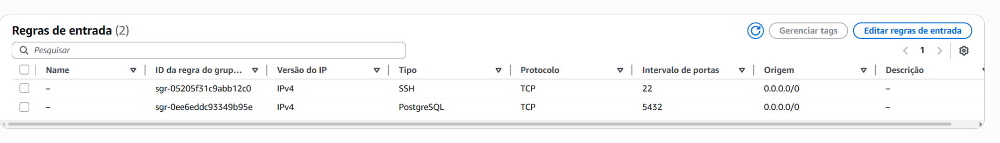

*Fonte: Elaborado pelos próprios autores.*

**Figura 52 - Regras de Saída**

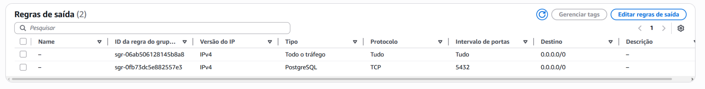

*Fonte: Elaborado pelos próprios autores.*

Como sistema gerenciador de banco de dados (SGBD), foi adotado o PostgreSQL, um dos mais robustos e confiáveis sistemas de código aberto disponíveis. O PostgreSQL foi instalado na instância EC2 e configurado para atender às demandas operacionais da BluCoop. Após a instalação, foi criado um banco de dados específico para o projeto, denominado "blucoop", bem como uma role administrativa com as permissões necessárias para gerenciar e acessar os dados com segurança.

**Figura 53 - Instalação do PostgreSQL e Verificação de Status**

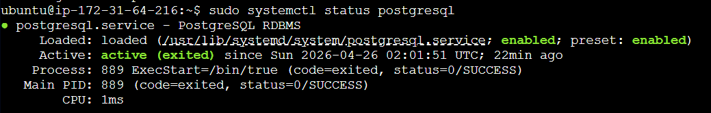

*Fonte: Elaborado pelos próprios autores.*

**Figura 54 - Configuração do Banco de Dados "blucoop"**

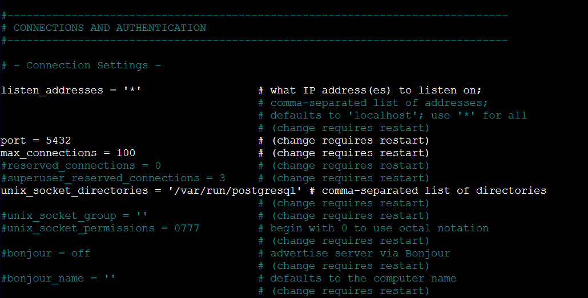

*Fonte: Elaborado pelos próprios autores.*

Para permitir que as aplicações da cooperativa se comuniquem com o banco de dados remotamente, foram realizados ajustes nas configurações internas do PostgreSQL. O serviço foi configurado para aceitar conexões provenientes de diferentes origens, e as políticas de autenticação foram definidas para exigir credenciais válidas em toda tentativa de acesso. Esse conjunto de configurações assegura que o banco de dados esteja acessível aos sistemas autorizados, ao mesmo tempo em que mantém a integridade e a confidencialidade das informações armazenadas.

**Figura 55 - Configuração Interna do PostgreSQL**

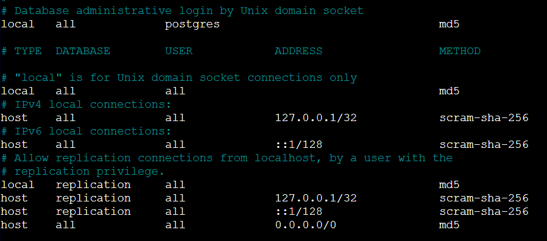

*Fonte: Elaborado pelos próprios autores.*

**Figura 56 - Acesso ao Banco de Dados com as Credenciais Criadas**

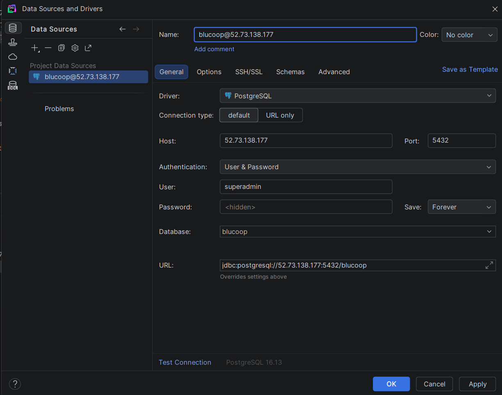

*Fonte: Elaborado pelos próprios autores.*

**Figura 57 - Retorno do Banco de Dados**

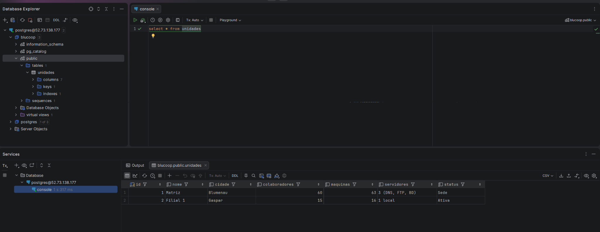

*Fonte: Elaborado pelos próprios autores.*

Por fim, a combinação entre a plataforma AWS, o sistema PostgreSQL e as políticas de segurança configuradas proporcionam um ambiente confiável, seguro e de fácil manutenção, alinhado aos requisitos técnicos e operacionais do projeto.

### 11.2.4 SERVIDOR FTP

O File Transfer Protocol (FTP) é um protocolo de comunicação destinado a transferência de arquivos entre computadores em uma rede. Para a BluCoop, a implementação de um servidor FTP visa centralizar e padronizar o compartilhamento de arquivos entre os colaboradores e sistemas da cooperativa, oferecendo um canal dedicado e controlado para envio e recebimento de dados. A solução foi hospedada em infraestrutura de nuvem pública da AWS, em uma instância EC2 com sistema operacional Ubuntu, localizada na região us-east-1 (Norte da Virgínia) e IP público 13.220.115.28. A escolha pela nuvem garante disponibilidade contínua do serviço e acesso remoto aos recursos de qualquer ponto com conexão à internet.

**Figura 58 - Exibição dos Detalhes da Instância EC2 Criada**

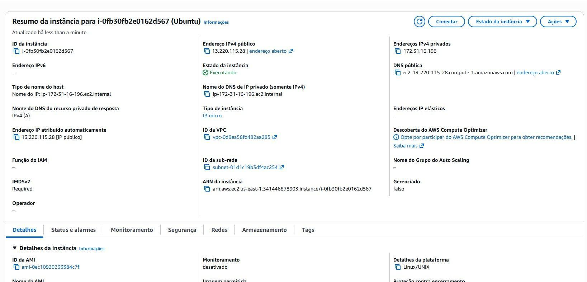

*Fonte: Elaborado pelos próprios autores.*

O servidor FTP foi implementado utilizando o vsftpd (Very Secure FTP Daemon), um software amplamente adotado em ambientes Linux por sua leveza, estabilidade e foco em segurança. Entre as configurações aplicadas, destaca-se a habilitação do modo de escrita, que permite o envio de arquivos ao servidor, e o confinamento dos usuários ao seu diretório home (chroot), impedindo que naveguem livremente pela estrutura de arquivos do sistema operacional. Abaixo, é possível visualizar as configurações citadas:

```text
write_enable=YES
chroot_local_user=YES
allow_writeable_chroot=YES
pasv_enable=YES
pasv_min_port=40000
pasv_max_port=40100
pasv_address=13.220.115.28
```

O serviço opera na porta padrão 21, responsável pelo canal de controle das conexões FTP. Além disso, foi habilitado o modo passivo de transferência, no qual o servidor indica ao cliente quais portas utilizar para o tráfego de dados. Esse modo é essencial em ambientes onde os clientes estão atrás de firewalls ou roteadores com NAT, situação comum na infraestrutura das filiais da BluCoop. O controle de tráfego da instância foi realizado por meio de um Security Group na AWS, que funciona como um firewall virtual. Foram liberadas exclusivamente a porta 21 para o canal de controle e um intervalo de portas para o modo passivo de transferência de dados, bloqueando qualquer outro tipo de acesso não autorizado à instância.

**Figura 59 - Regras de Entrada Configuradas**

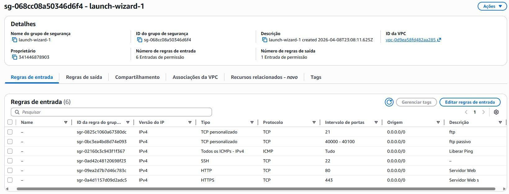

*Fonte: Elaborado pelos próprios autores.*

O serviço opera na porta padrão 21, responsável pelo canal de controle das conexões FTP. Além disso, foi habilitado o modo passivo de transferência, no qual o servidor indica ao cliente quais portas utilizar para o tráfego de dados. Esse modo é essencial em ambientes onde os clientes estão atrás de firewalls ou roteadores com NAT, situação comum na infraestrutura das filiais da BluCoop. Para o acesso ao serviço, foi criado um usuário dedicado exclusivamente às operações FTP (ftpuser), separando as credenciais de transferência de arquivos das demais contas administrativas do servidor.

A integridade da configuração foi verificada por meio de testes realizados em dois cenários distintos. No primeiro, a conexão foi estabelecida localmente, diretamente no servidor, confirmando que o serviço estava ativo e respondendo corretamente às requisições.

**Figura 60 - Teste Local: Login**

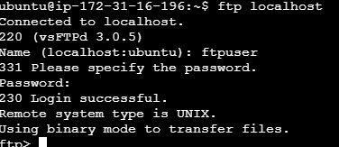

*Fonte: Elaborado pelos próprios autores.*

**Figura 61 - Teste Local: Listagem de Arquivos no Servidor**

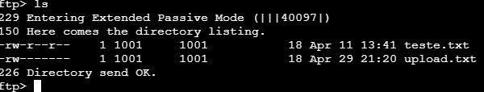

*Fonte: Elaborado pelos próprios autores.*

No segundo cenário, a conexão foi realizada a partir de um computador externo à AWS, simulando o acesso de um colaborador remoto, o que validou tanto a conectividade pública quanto às regras de firewall configuradas.

**Figura 62 - Teste Externo: Login**

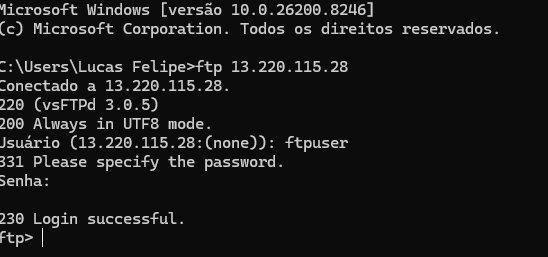

*Fonte: Elaborado pelos próprios autores.*

**Figura 63 - Teste Externo: Listagem de Arquivos Remotamente**

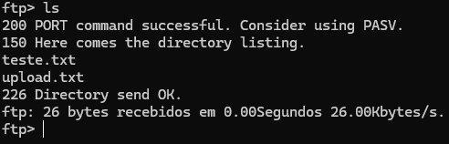

*Fonte: Elaborado pelos próprios autores.*

Em ambos os cenários, foram executadas operações de download e upload de arquivos, que retornaram o status de conclusão bem-sucedida, como é possível visualizar nas imagens a seguir.

**Figura 64 - Teste de Download de Arquivo (GET): Do Servidor para o Computador Local**

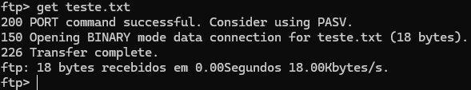

*Fonte: Elaborado pelos próprios autores.*

**Figura 65 - Teste de Upload de Arquivo (PUT): Do Computador Local para o Servidor**

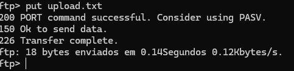

*Fonte: Elaborado pelos próprios autores.*

Assim, é possível concluir que os testes realizados confirmaram que o servidor FTP da BluCoop está operacional e apto a realizar transferências de arquivos de forma confiável, tanto em acessos internos quanto remotos.

### 11.2.5 ELASTIC FILE SYSTEM (EFS)

O Amazon Elastic File System (EFS) é um serviço gerenciado de armazenamento em nuvem que oferece um sistema de arquivos compartilhado, escalável e de alta disponibilidade. Diferentemente de soluções de armazenamento tradicionais, o EFS permite que múltiplas instâncias acessem simultaneamente o mesmo conjunto de arquivos via rede, tornando-o ideal para ambientes distribuídos como o da BluCoop, que conta com uma matriz e cinco filiais operando de forma integrada. A adoção do EFS na infraestrutura da cooperativa tem como objetivo centralizar o compartilhamento de arquivos entre todas as unidades, eliminando a necessidade de soluções isoladas por filial e garantindo que qualquer alteração realizada na matriz seja imediatamente refletida em todas as demais instâncias da rede. Antes da criação do sistema de arquivos, foram configurados dois Security Groups distintos para controlar o tráfego de rede de forma segmentada. O primeiro, associado ao próprio EFS, foi configurado para aceitar conexões via protocolo NFS na porta 2049, que é o padrão para comunicação de sistemas de arquivos em rede.

**Figura 66 - Regras de Entrada: EFS**

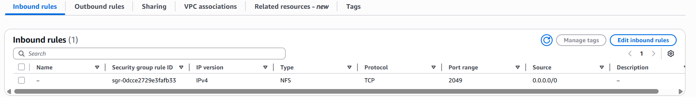

*Fonte: Elaborado pelos próprios autores.*

**Figura 67 - Regras de Saída: EFS**

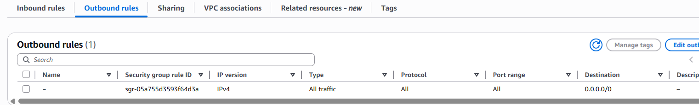

*Fonte: Elaborado pelos próprios autores.*

O segundo, associado às instâncias EC2, foi configurado para permitir acesso administrativo via SSH e verificações de conectividade, facilitando o gerenciamento e o monitoramento das máquinas durante a implantação.

**Figura 68 - Regras de Entrada: Instâncias EC2**

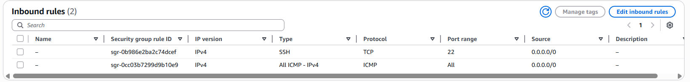

*Fonte: Elaborado pelos próprios autores.*

**Figura 69 - Regras de Saída: Instâncias EC2**

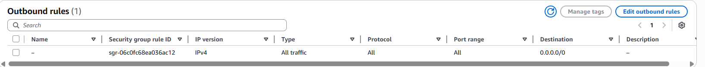

*Fonte: Elaborado pelos próprios autores.*

Essa separação entre os grupos de segurança do EFS e das instâncias EC2 segue as boas práticas de segurança em nuvem, garantindo que cada recurso exponha apenas as portas estritamente necessárias para seu funcionamento. O sistema de arquivos foi criado com o nome EFS-Matriz e configurado no modo regional, o que garante a replicação dos dados em múltiplas Zonas de Disponibilidade (Availability Zones) da AWS. Esse modo oferece maior resiliência ao ambiente, pois mesmo que uma zona enfrente instabilidades, o sistema de arquivos permanece acessível pelas demais.

**Figura 70 - Configuração do EFS**

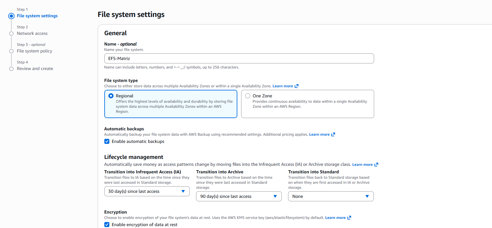

*Fonte: Elaborado pelos próprios autores.*

**Figura 71 - Zonas de Disponibilidade**

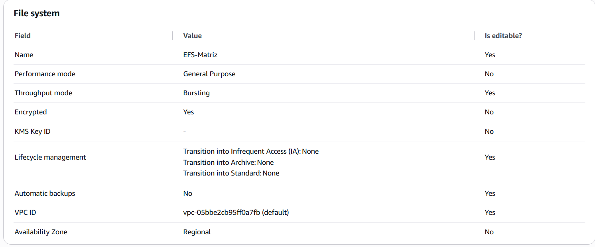

*Fonte: Elaborado pelos próprios autores.*

O acesso de rede foi configurado por meio de mount targets em cada zona de disponibilidade utilizada, todos associados ao Security Group SG-EFS-Filiais e pertencentes à mesma Virtual Private Cloud (VPC). O EFS foi provisionado com modo de performance General Purpose e throughput do tipo Bursting, configuração adequada para cargas de trabalho que alternam entre períodos de alta e baixa demanda. A criptografia de dados em repouso também foi habilitada, reforçando a proteção das informações armazenadas.

**Figura 72 - Configuração do Acesso de Rede**

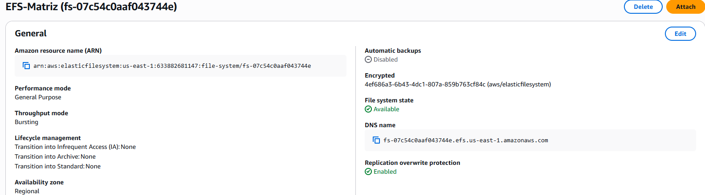

*Fonte: Elaborado pelos próprios autores.*

**Figura 73 - Acesso de Rede: Zonas de Disponibilidade**

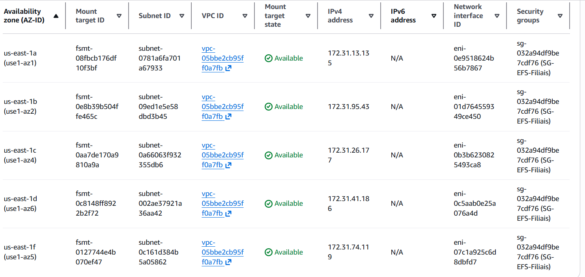

*Fonte: Elaborado pelos próprios autores.*

Para representar as unidades da cooperativa, foram criadas seis instâncias EC2 (uma para a matriz e cinco para as filiais), todas com a mesma configuração base: tipo t2.micro, sistema operacional Ubuntu 24.04 LTS e pertencentes à mesma VPC e subnet dos mount targets do EFS. Cada instância recebeu um par de chaves único para acesso administrativo e teve o IP público habilitado para facilitar o gerenciamento remoto.

**Figura 74 - Instâncias Criadas**

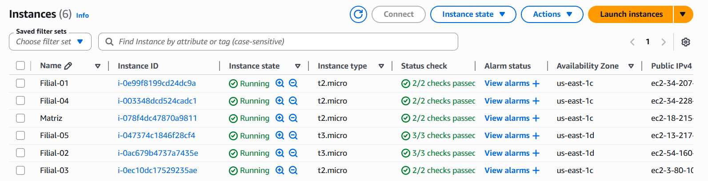

*Fonte: Elaborado pelos próprios autores.*

A montagem do EFS foi automatizada por meio do recurso User Data do EC2, que executa scripts de configuração no momento em que a instância é inicializada pela primeira vez. Foram utilizados scripts distintos para a matriz e para as filiais, uma vez que cada tipo de unidade possui responsabilidades diferentes dentro da arquitetura: a matriz atua como ponto de escrita principal, enquanto as filiais consomem os arquivos compartilhados. Essa abordagem elimina a necessidade de configuração manual em cada máquina, tornando o processo de implantação mais ágil e padronizado.

**Figura 75 - User Data: Matriz**

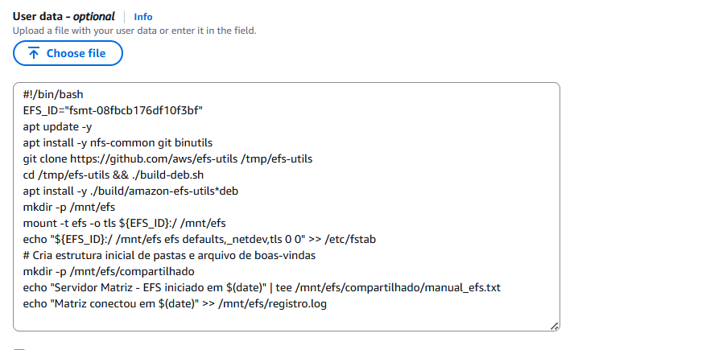

*Fonte: Elaborado pelos próprios autores.*

**Figura 76 - User Data: Filiais**

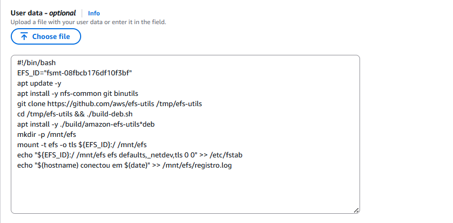

*Fonte: Elaborado pelos próprios autores.*

Após a criação das instâncias, foram realizados testes para validar tanto a montagem do sistema de arquivos quanto o compartilhamento de dados entre as unidades. Em cada instância, foi verificado que o EFS havia sido montado corretamente na inicialização, confirmando o funcionamento dos scripts de automação.

**Figura 77 - Teste Montagem EFS: Matriz**

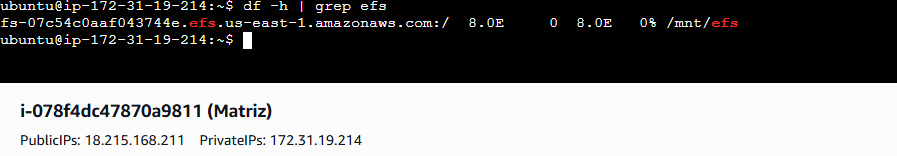

*Fonte: Elaborado pelos próprios autores.*

**Figura 78 - Teste Montagem EFS: Filial 1**

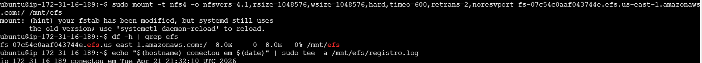

*Fonte: Elaborado pelos próprios autores.*

**Figura 79 - Teste Montagem EFS: Filial 2**

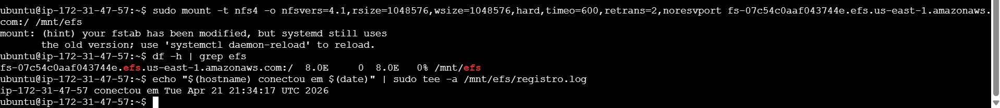

*Fonte: Elaborado pelos próprios autores.*

**Figura 80 - Teste Montagem EFS: Filial 3**

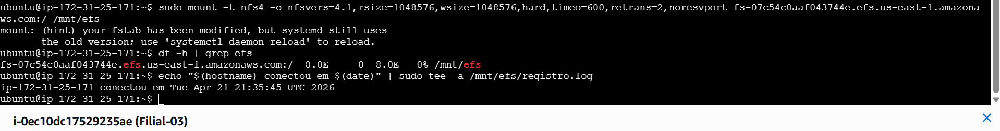

*Fonte: Elaborado pelos próprios autores.*

**Figura 81 - Teste Montagem EFS: Filial 4**

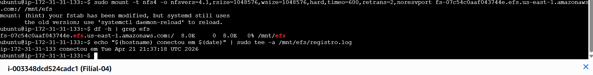

*Fonte: Elaborado pelos próprios autores.*

**Figura 82 - Teste Montagem EFS: Filial 5**

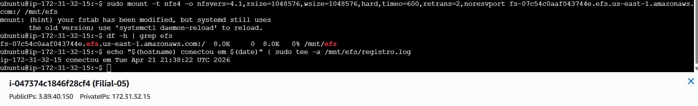

*Fonte: Elaborado pelos próprios autores.*

**Figura 83 - Teste de Conexão: Matriz X Filiais**

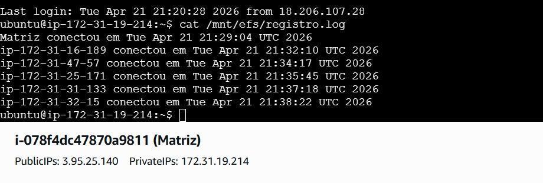

*Fonte: Elaborado pelos próprios autores.*

O teste de compartilhamento consistiu na criação de um arquivo na instância da matriz, identificado como "Manual NFS - Teste BluCoop", e na verificação imediata de sua presença em todas as cinco filiais.

**Figura 84 - Teste de Compartilhamento: Matriz**

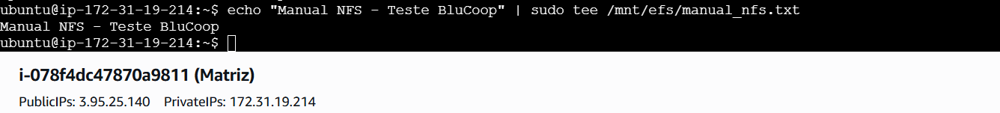

*Fonte: Elaborado pelos próprios autores.*

**Figura 85 - Teste de Compartilhamento: Filial 1**

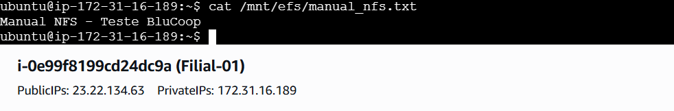

*Fonte: Elaborado pelos próprios autores.*

**Figura 86 - Teste de Compartilhamento: Filial 2**

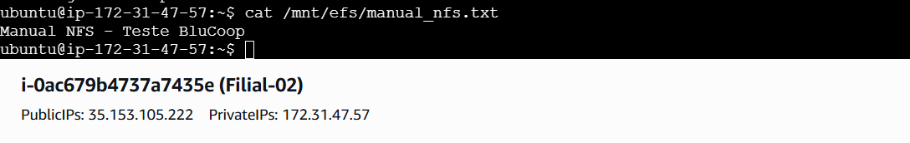

*Fonte: Elaborado pelos próprios autores.*

**Figura 87 - Teste de Compartilhamento: Filial 3**

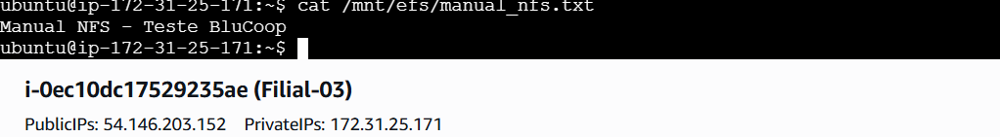

*Fonte: Elaborado pelos próprios autores.*

**Figura 88 - Teste de Compartilhamento: Filial 4**

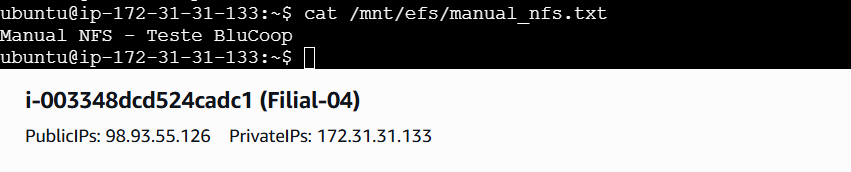

*Fonte: Elaborado pelos próprios autores.*

**Figura 89 - Teste de Compartilhamento: Filial 5**

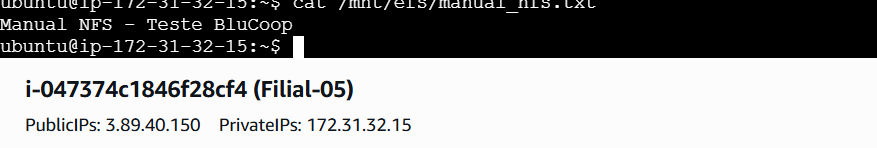

*Fonte: Elaborado pelos próprios autores.*

O arquivo foi encontrado em cada uma das instâncias, confirmando que o EFS está funcionando corretamente como ponto central de armazenamento compartilhado, com propagação em tempo real entre todas as unidades da cooperativa.
