# Etapa 3 - Gerência e Monitoração de Ambientes de Redes

A presente seção corresponde à etapa de gerência e monitoração de ambientes de redes do projeto de infraestrutura da cooperativa BluCoop, tendo como principal objetivo implementar mecanismos de monitoramento capazes de acompanhar, em tempo real, o funcionamento e a disponibilidade dos serviços implantados. Para isso, foi utilizada a plataforma Zabbix, permitindo centralizar a coleta de métricas, geração de gráficos, monitoramento de desempenho e identificação automática de falhas nos serviços e servidores da infraestrutura. Nesta etapa, foram monitorados diferentes componentes da infraestrutura da cooperativa, possibilitando acompanhar indicadores de utilização, disponibilidade e funcionamento dos serviços em ambientes em nuvem e virtualizados. O monitoramento implementado permitiu validar a estabilidade operacional dos servidores e serviços configurados anteriormente, além de demonstrar a importância da monitoração contínua em ambientes corporativos, contribuindo para maior controle operacional, rápida identificação de problemas e apoio à administração da infraestrutura de TI.

## 12.1 Ambiente local - Virtualização on-premise

### 12.1.1 Servidor DHCP

As imagens apresentam a validação dos principais serviços utilizados na infraestrutura de monitoramento. O serviço zabbix-agent foi executado diretamente no servidor DHCP (servidor-dhcp), permitindo a coleta e envio das métricas do sistema para monitoramento remoto. Já o serviço zabbix-server foi executado em uma máquina virtual separada, utilizando o Zabbix Appliance oficial, responsável pelo processamento das informações, armazenamento dos dados monitorados e disponibilização do painel web de gerenciamento.

**Figura 90 - Serviço zabbix-agent ativo**

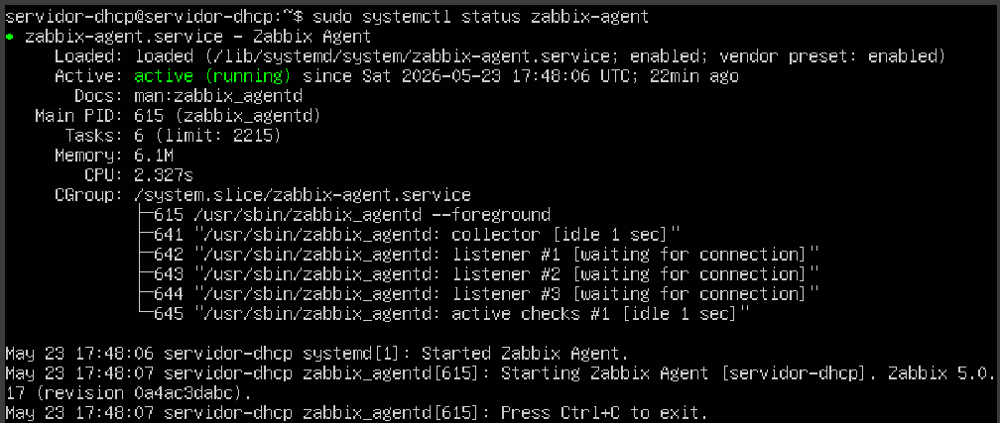

*Fonte: Elaborado pelos próprios autores.*

**Figura 91 - Serviço zabbix-server ativo**

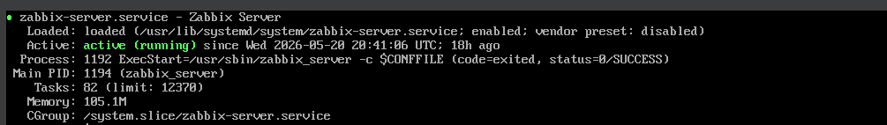

*Fonte: Elaborado pelos próprios autores.*

O gráfico abaixo apresenta o monitoramento do desempenho geral do servidor DHCP durante um período contínuo de 1 hora. Foram acompanhadas as métricas de utilização de CPU (linha laranja), uso de memória RAM (linha azul) e carga média do sistema (linha verde). Durante a maior parte do teste, foi executado um stress test utilizando o comando "stress --cpu 2 --timeout 3600" para elevar o consumo de CPU e validar o funcionamento do monitoramento em tempo real. Nos minutos finais, o stress test e o tráfego de rede foram interrompidos, resultando na queda das métricas, seguida do desligamento do servidor DHCP no último minuto para demonstrar visualmente a interrupção da atividade do sistema.

**Figura 92 - Gráfico de desempenho geral**

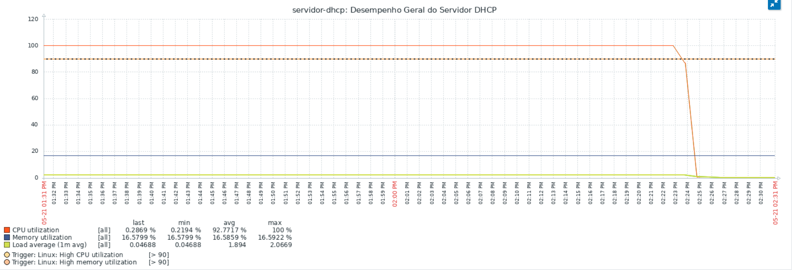

*Fonte: Elaborado pelos próprios autores.*

O gráfico em sequência apresenta o monitoramento do tráfego de rede da interface interna enp0s8 do servidor DHCP durante um período de 1 hora. A área verde representa os dados recebidos pela interface, enquanto a linha azul representa os dados enviados. Durante os testes, foi mantida comunicação contínua entre o cliente DHCP e o servidor, através de ping do IP do servidor, gerando tráfego constante na rede interna virtualizada. Nos minutos finais, o encerramento do ping no cliente e o desligamento do servidor DHCP provocaram redução significativa no tráfego monitorado, evidenciando a resposta em tempo real do Zabbix às alterações da rede.

**Figura 93 - Gráfico de rede**

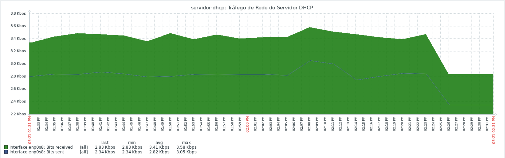

*Fonte: Elaborado pelos próprios autores.*

O gráfico a seguir apresenta o monitoramento da disponibilidade e estabilidade operacional do servidor DHCP ao longo de 1 hora de testes contínuos. A linha verde representa o uptime do sistema, demonstrando funcionamento estável durante praticamente todo o período monitorado, enquanto a linha azul indica a quantidade de processos ativos no servidor. O monitoramento também acompanhou a disponibilidade do Zabbix Agent, responsável pela comunicação com o servidor de monitoramento. Nos instantes finais do teste, o desligamento manual do servidor DHCP provocou a interrupção da coleta, evidenciando a detecção automática de indisponibilidade pelo Zabbix.

**Figura 94 - Gráfico de disponibilidade**

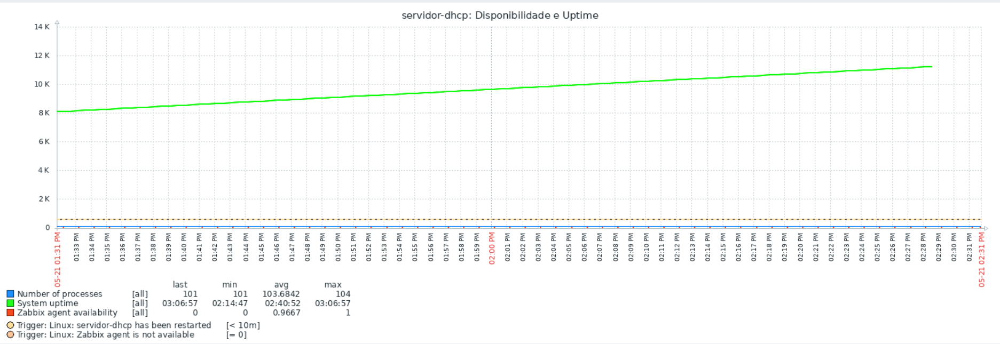

*Fonte: Elaborado pelos próprios autores.*

Foi criada uma trigger para monitorar o estado do serviço DHCP em tempo real. Quando o serviço é interrompido, o Zabbix identifica automaticamente a falha e gera um alerta visual no painel de monitoramento do host, demonstrando a capacidade de detecção automática de indisponibilidade do serviço crítico.

**Figura 95 - Trigger de monitoramento do serviço DHCP**

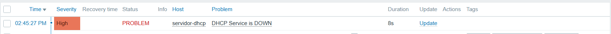

*Fonte: Elaborado pelos próprios autores.*

### 12.1.2 Active Directory (AD)

Para realizar o monitoramento do Active Directory (AD), foram utilizadas duas máquinas virtuais executadas no VirtualBox, interligadas por uma rede interna dedicada denominada intnet. O primeiro ambiente é o servidor Zabbix, baseado em Ubuntu Server 22.04 LTS, responsável por centralizar o monitoramento, armazenar os dados coletados e disponibilizar a interface web de visualização. O segundo é o servidor denominado BluCoop_AD, executando Windows Server 2019, que hospeda os serviços de domínio da organização, já configurado anteriormente. Cada máquina virtual possui dois adaptadores de rede com funções distintas. No servidor Zabbix, a interface enp0s3 está conectada à rede interna com o endereço IP 10.0.0.10/24, a qual é utilizada exclusivamente para a comunicação com o servidor AD. A interface enp0s8, configurada em modo Bridge, recebeu o IP 192.168.18.50 e é responsável pelo acesso externo, a fim de permitir que o navegador do operador acesse a interface web do Zabbix pelo endereço http://192.168.18.50. No servidor AD, a interface Ethernet 2, também conectada à rede interna intnet, possui o IP 10.0.0.78/24 e é por ela que o agente Zabbix recebe as requisições de coleta. A escolha por uma rede interna dedicada entre os dois servidores garante isolamento e segurança na comunicação, independente das variações da rede física externa.

**Figura 96 - Serviço zabbix-server ativo**

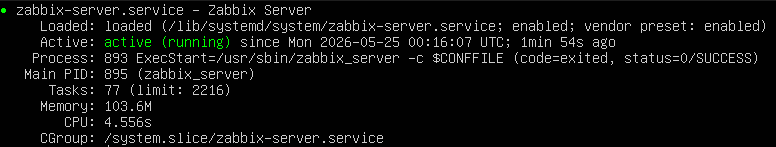

*Fonte: Elaborado pelos próprios autores.*

**Figura 97 - Serviço zabbix-agent ativo**

*Fonte: Elaborado pelos próprios autores.*

Para o armazenamento dos dados de monitoramento, foi adotado o PostgreSQL 14, configurado com um banco de dados dedicado denominado zabbix. A interface web é servida pelo Nginx 1.18 em conjunto com o PHP 8.1 e o módulo php8.1-fpm, responsável pelo processamento das requisições da aplicação.

Para que o Zabbix Server pudesse coletar dados diretamente do servidor Windows, o Zabbix Agent foi instalado no BluCoop_AD. O agente foi configurado para se comunicar exclusivamente com o servidor Zabbix pelo IP 10.0.0.10, utilizando a rede interna intnet. O hostname definido no arquivo de configuração do agente é BluCoop_AD, correspondendo ao nome do host cadastrado na interface web do Zabbix. No Zabbix, foram criados nove itens de monitoramento associados ao host BluCoop_AD, todos do tipo Zabbix Agent. Para a visualização centralizada dos dados coletados, foi criado o dashboard "BluCoop - Active Directory", organizado em três páginas. A primeira página, denominada "Visão Geral", tem como objetivo apresentar o estado atual do ambiente de forma imediata e objetiva. Os quatro primeiros itens que compõem o dashboard monitoram o estado dos serviços críticos do AD: DNS, responsável pela resolução de nomes no domínio; KDC (Kerberos), que gerencia a autenticação dos usuários; Netlogon, que processa as requisições de logon na rede; e NTDS (NT Directory Services), o núcleo do AD. Cada um desses itens retorna o valor "Running" quando o serviço está ativo, ou "Stopped" em caso de falha. Os demais itens capturam informações sobre o domínio e seus usuários.

**Figura 98 - Dashboard "Visão Geral"**

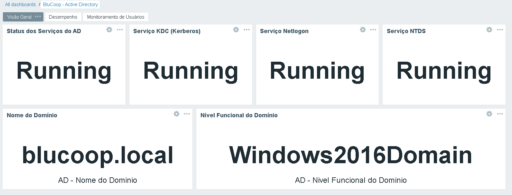

*Fonte: Elaborado pelos próprios autores.*

A segunda página, denominada "Desempenho", é dedicada ao monitoramento de recursos do servidor. Nela estão presentes, um gráfico de linha que exibe a utilização de CPU e memória do BluCoop_AD ao longo do tempo, além do widget de problemas do AD que exibe em tempo real os alertas gerados pelo Zabbix para o host BluCoop_AD.

**Figura 99 - Dashboard "Desempenho"**

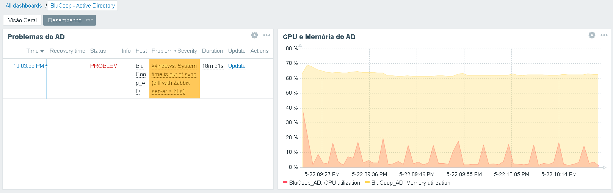

*Fonte: Elaborado pelos próprios autores.*

A terceira página, "Usuários", concentra as informações relacionadas às contas do domínio. O gráfico de evolução de usuários exibe lado a lado o total de usuários e os usuários ativos, revelando ao longo do tempo o crescimento do domínio e a proporção de contas habilitadas.

**Figura 100 - Dashboard "Usuários"**

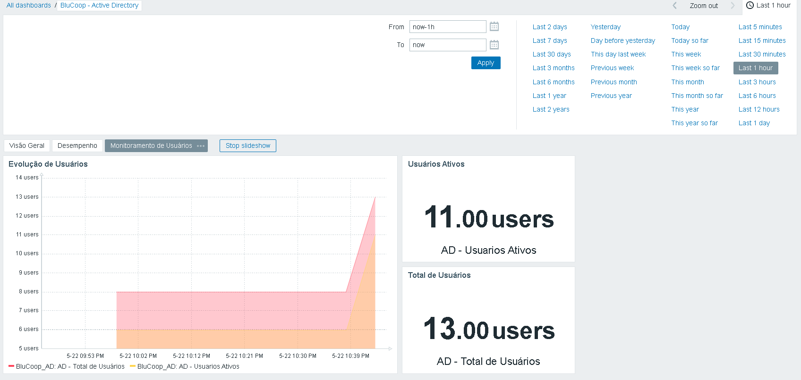

*Fonte: Elaborado pelos próprios autores.*

## 12.2 Ambiente em Nuvem

### 12.2.1 Domain Name System (DNS)

O painel apresentado demonstra o monitoramento contínuo da infraestrutura e distribuição de requisições da aplicação, permitindo acompanhar em tempo real o comportamento do ambiente e identificar possíveis falhas ou instabilidades.

Métricas Monitoradas:

- Requests (sum): Exibe o volume total de requisições recebidas ao longo do período monitorado. Isso permite identificar picos de acesso, padrões de utilização e possíveis sobrecargas no sistema;
- Data Transfer: Monitora a quantidade de dados trafegados, tanto de upload quanto de download. Essa métrica auxilia na análise de consumo de banda, performance da aplicação e comportamento dos usuários;
- Error Rate (%): Apresenta a taxa de erros em relação ao total de requisições realizadas.

O monitoramento diferencia:

- 4xx Errors: erros relacionados à requisição do cliente;
- 5xx Errors: falhas internas do servidor;
- Lambda Edge Errors: falhas relacionadas a processamento em borda/CDN.

Esse tipo de monitoramento é essencial para garantir estabilidade da aplicação, identificação rápida de falhas, análise de performance, prevenção de indisponibilidades e tomada de decisões baseada em métricas reais. Além disso, o acompanhamento contínuo permite agir proativamente antes que problemas afetem a experiência do usuário final.

**Figura 101 - Monitoramento de Distribuição e Performance do DNS**

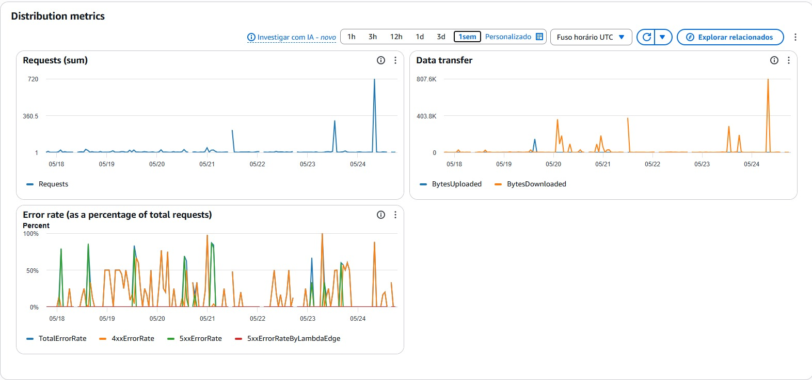

*Fonte: Elaborado pelos próprios autores.*

### 12.2.2 Servidor Web e API

O primeiro gráfico mostra o uso de espaço do filesystem principal /. O consumo ficou estável em torno de 50,8%, com variação mínima durante o período observado. Isso indica que o teste de carga não gerou crescimento relevante de arquivos ou logs no disco. Os limites de alerta aparecem em 80% e 90%, então o servidor permaneceu dentro de uma faixa segura.

**Figura 102 - Uso de disco**

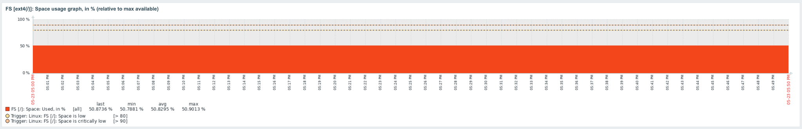

*Fonte: Elaborado pelos próprios autores.*

Nos gráficos de sistema, o load average teve um pico pequeno durante a execução dos testes, mas permaneceu abaixo de 0,5, o que é baixo para uma instância com capacidade disponível. O uso de CPU também ficou controlado, com maior parte do tempo em idle e pequenos aumentos em user/system time durante as requisições. A memória ficou estável, com aproximadamente metade disponível, e o swap permaneceu em 0, indicando que o sistema não precisou usar memória virtual em disco.

**Figura 103 - CPU, Memória, Load e Swap**

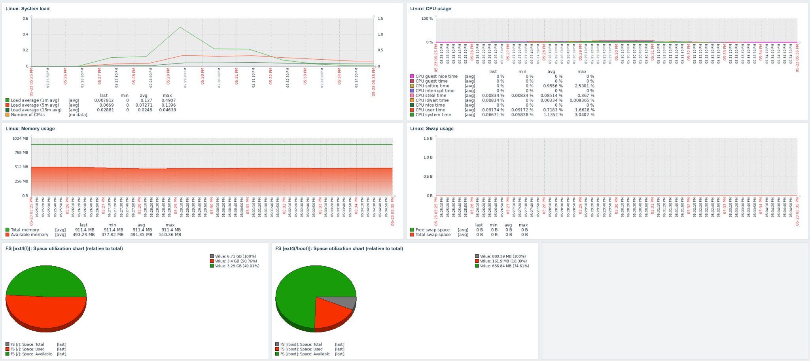

*Fonte: Elaborado pelos próprios autores.*

Os gráficos de I/O do disco nvme0n1 mostram baixa taxa de leitura e escrita, com picos pequenos durante o teste. A latência média de escrita ficou baixa, na faixa de milissegundos, e a utilização do disco praticamente não chegou a níveis relevantes. Isso indica que o teste gerou mais impacto em rede e processamento do que em armazenamento.

**Figura 104 - Discos I/O**

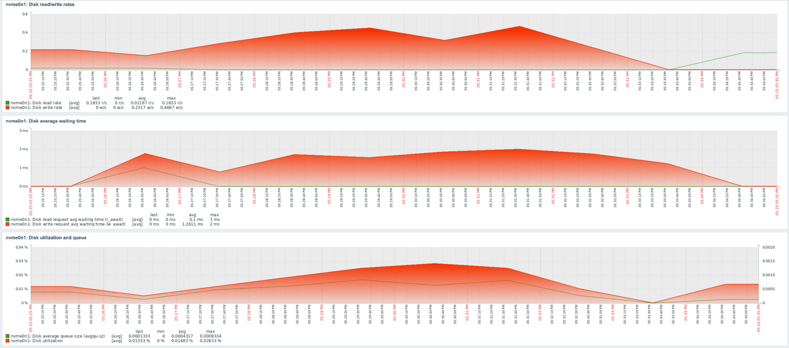

*Fonte: Elaborado pelos próprios autores.*

O gráfico da interface ens5 mostra aumento claro no tráfego de saída durante o teste de carga. Isso é esperado, porque a EC2 Web estava respondendo várias requisições HTTP/API. O tráfego recebido foi menor que o enviado, comportamento comum em páginas e respostas HTTP, onde a requisição é pequena e a resposta carrega mais dados. Não houve pacotes com erro ou descartados, o que indica comunicação estável.

**Figura 105 - Rede**

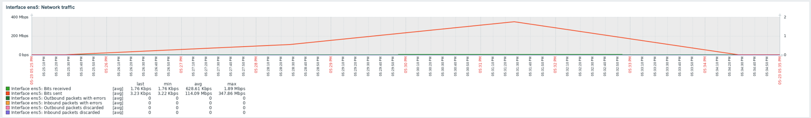

*Fonte: Elaborado pelos próprios autores.*

Portanto, os gráficos mostram que o Zabbix conseguiu capturar corretamente o comportamento da EC2 Web durante a carga: aumento de tráfego de rede, pequenas variações de CPU e load, estabilidade de memória e baixo impacto em disco. A instância respondeu bem ao teste, sem sinais de saturação, sem uso de swap e sem atingir limites críticos de disco ou CPU. Para validar que a arquitetura estava ativa no momento dos testes, foram coletados os status dos principais serviços nas duas EC2: a EC2 do Zabbix Server e a EC2 do Web Server. Na EC2 Zabbix Server, o serviço postgresql aparece como enabled e active (exited). Esse comportamento é esperado no Ubuntu, pois o serviço principal do PostgreSQL pode gerenciar os clusters internos e finalizar o processo de controle com sucesso. Isso indica que o PostgreSQL está habilitado para iniciar com o sistema e disponível para uso pelo Zabbix. O serviço apache2 da EC2 Zabbix Server aparece como enabled e active (running). Ele é responsável por servir a interface web do Zabbix. O status também mostra métricas do próprio Apache, como requisições totais, workers ociosos/ocupados, requisições por segundo e bytes servidos por segundo, confirmando que o frontend web do Zabbix estava operacional.

**Figura 106 - Status dos serviços**

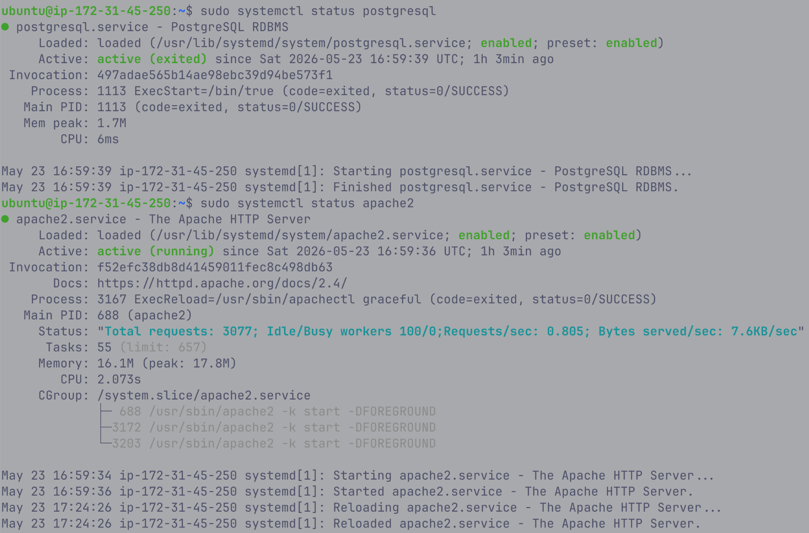

*Fonte: Elaborado pelos próprios autores.*

Ainda na EC2 Zabbix Server, o serviço zabbix-agent aparece como enabled e active (running). Esse agente permite que a própria máquina do Zabbix também seja monitorada, coletando informações locais como CPU, memória, processos e disponibilidade do sistema.

**Figura 107 - Status do serviço zabbix-agent**

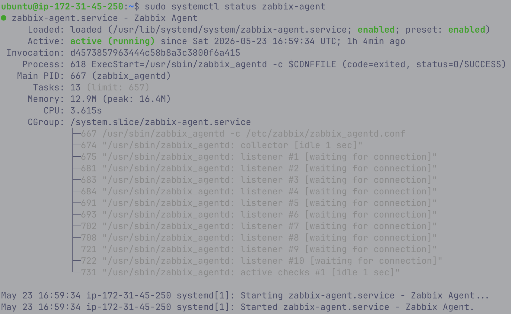

*Fonte: Elaborado pelos próprios autores.*

O serviço zabbix-server também aparece como enabled e active (running). Esse é o serviço central da solução de monitoramento, responsável por coletar dados dos hosts monitorados, processar métricas, avaliar triggers e armazenar informações no banco PostgreSQL. O status mostra múltiplos processos internos do Zabbix, como pollers, trappers, history syncers e alert manager, indicando que o servidor de monitoramento está ativo.

**Figura 108 - Status do serviço zabbix-service**

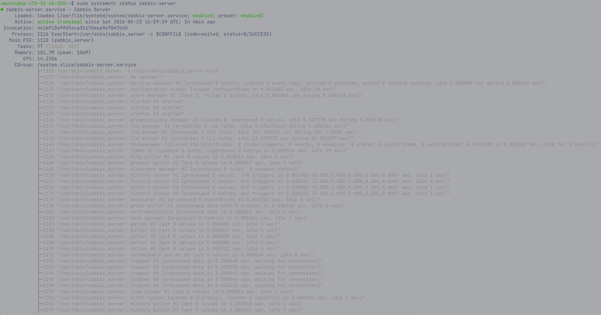

*Fonte: Elaborado pelos próprios autores.*

Na EC2 Web Server, o serviço apache2 aparece como enabled e active (running). Esse serviço é responsável por servir o site público da BluCoop e atuar como proxy reverso para a API Node/Express. O status confirma que o Apache iniciou corretamente e estava disponível durante a demonstração. Também na EC2 Web Server, o serviço zabbix-agent aparece como enabled e active (running). Esse agente é o componente que permite ao Zabbix Server coletar métricas da EC2 Web, como uso de CPU, memória, disco, rede, processos e disponibilidade das portas monitoradas.

**Figura 109 - Status do serviço apache2**

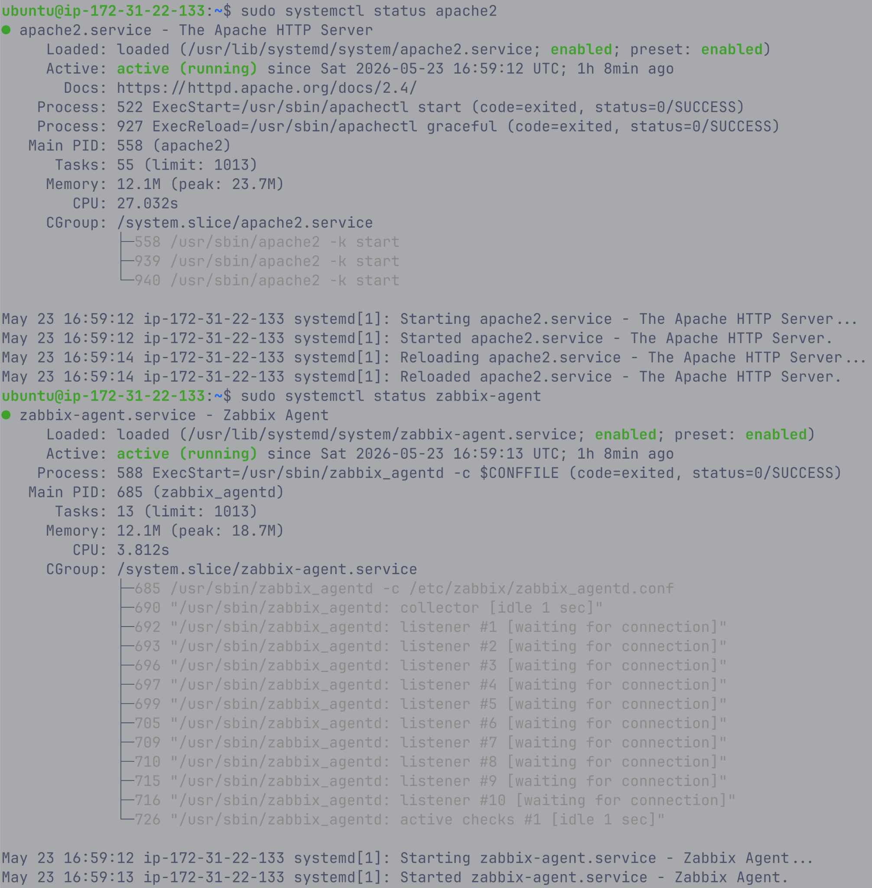

*Fonte: Elaborado pelos próprios autores.*

Além dos serviços gerenciados pelo systemctl, a API da BluCoop foi validada com pm2 status. O processo blucoop-api aparece como online, com modo fork, uso baixo de CPU e memória, e logs indicando API rodando na porta 3000. Isso confirma que o backend Node/Express responsável pelo CRUD autenticado estava em execução.

**Figura 110 - Status dos serviços**

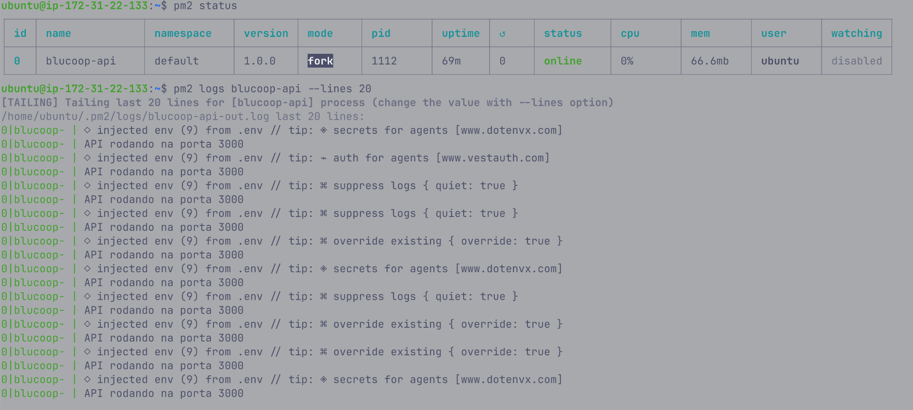

*Fonte: Elaborado pelos próprios autores.*

### 12.2.3 Banco de Dados

Foi feita a criação da Instância EC2 com Ubuntu 24.04 para a instalação do Zabbix Server, Zabbix Frontend (servidor web Apache) e Banco de Dados (MySQL). Para o Zabbix Server, foi alocado e associado um endereço IPv4 público estático (3.229.206.66) para garantir que o endereço de acesso ao painel web e de comunicação com os agentes não mudasse caso a máquina fosse reiniciada. Foi realizada a inicialização dos serviços no sistema operacional via terminal e configuração inicial via navegador. Para a instância com o banco de dados, realizou-se a instalação do pacote zabbix-agent no terminal da mesma com a seguinte edição do arquivo de configuração (/etc/zabbix/zabbix_agentd.conf) nela:

- Server=3.229.206.66 (Apontado para o IP do Zabbix Server);
- ServerActive=3.229.206.66 (Apontado para o IP do Zabbix Server para permitir envio de dados no modo ativo);
- Hostname= Definido como blucoopdb.

**Figura 111 - Status dos monitoramentos (instância do banco de dados)**

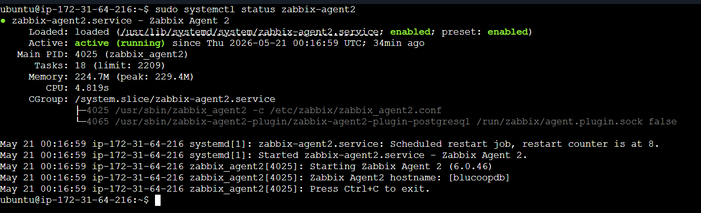

*Fonte: Elaborado pelos próprios autores.*

**Figura 112 - Status dos monitoramentos (instância do servidor Zabbix)**

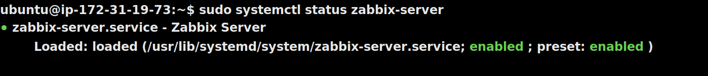

*Fonte: Elaborado pelos próprios autores.*

A máquina blucoopdb foi adicionada ao sistema de monitoramento e agrupada nas categorias Linux servers e Virtual machines. Em seguida, foi configurada uma interface do tipo Agent, apontando para o IP da máquina monitorada na porta padrão 10050. Para a coleta automática de métricas, foram associados dois templates nativos: o Linux by Zabbix agent, responsável pelo monitoramento de processamento, uso de memória RAM, disco e tráfego de rede, e o PostgreSQL by Zabbix agent 2, voltado ao acompanhamento das métricas do banco de dados. Por fim, foi desenvolvido um Mapa de Topologia de Rede visual e interativo no Zabbix, representando os nós da rede Zabbix Server e Servidor de Banco de Dados com um link lógico entre eles para monitoramento visual de quedas ou degradação de sinal.

**Figura 113 - Mapa de topologia de rede**

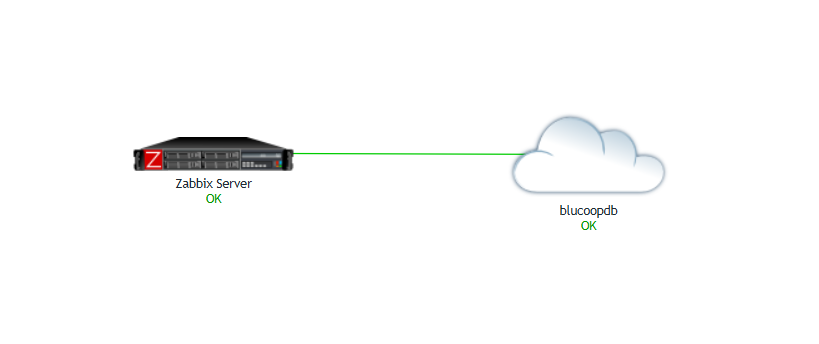

*Fonte: Elaborado pelos próprios autores.*

**Figura 114 - Gráfico Committed Transactions per Second utilizando o template PostgreSQL by Zabbix agent 2**

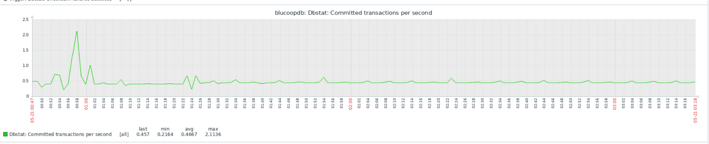

*Fonte: Elaborado pelos próprios autores.*

O gráfico Committed Transactions per Second exibe a taxa de transações confirmadas por segundo no banco de dados PostgreSQL, permitindo acompanhar em tempo real o volume de operações finalizadas com sucesso, possibilitando distinguir o comportamento do banco ao longo do tempo e identificar picos de carga ou períodos de baixa atividade transacional.

**Figura 115 - Gráfico Connections Sum: Total utilizando o template PostgreSQL by Zabbix agent 2**

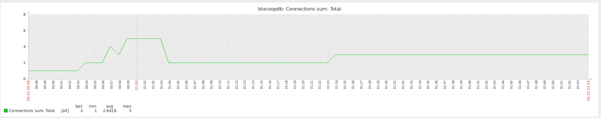

*Fonte: Elaborado pelos próprios autores.*

O gráfico Connections Sum: Total exibe o número total de conexões ativas estabelecidas com o banco de dados PostgreSQL ao longo do tempo. A legenda identifica o banco monitorado e serve de referência para acompanhar o volume de conexões simultâneas, permitindo detectar situações de sobrecarga de conexões ou verificar se o banco está operando dentro dos limites esperados.

### 12.2.4 Servidor FTP

Terminal do servidor EC2 (IP público: 3.87.76.149) mostrando os dois serviços ativos: vsftpd (FTP) rodando desde 13:02 UTC e Zabbix Agent 2 (versão 7.0.26) rodando desde 13:23 UTC, ambos com status active (running).

**Figura 116 - Serviços ativos**

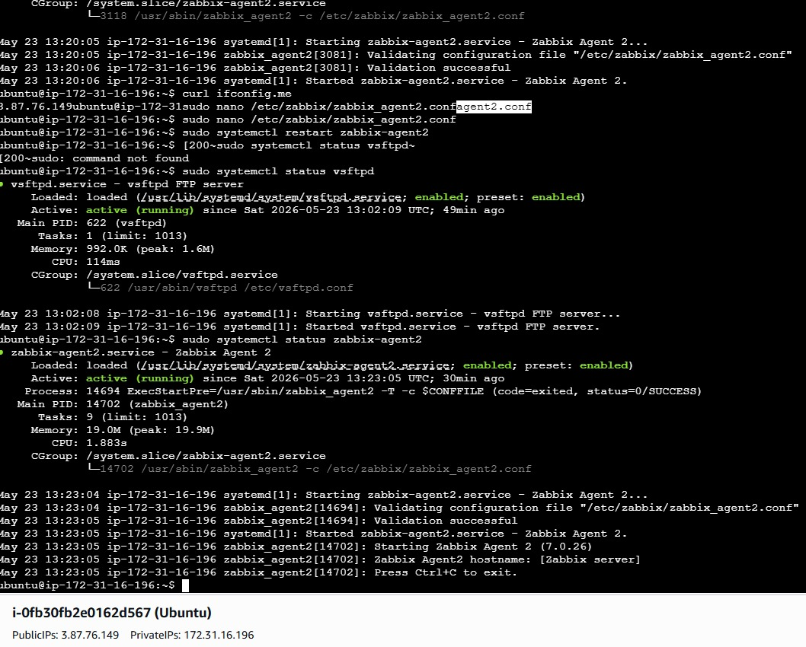

*Fonte: Elaborado pelos próprios autores.*

Security Group da instância EC2 (launch-wizard-1) com 7 regras de entrada configuradas: porta 21 (FTP), 40000-40100 (FTP passivo), 22 (SSH), 10050 (Zabbix Agent), 80 (HTTP), 443 (HTTPS) e ICMP liberado para ping.

**Figura 117 - Security Group**

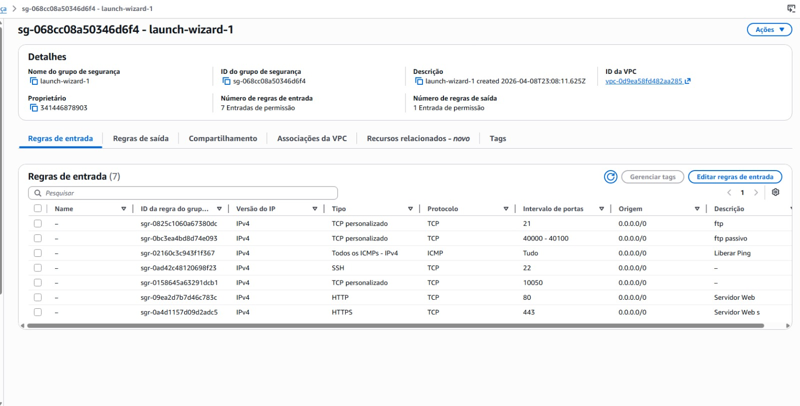

*Fonte: Elaborado pelos próprios autores.*

Gráficos de CPU do Servidor FTP BluCoop no Zabbix. "CPU jumps" mostra context switches estável em torno de 405/s e interrupções em 234/s. "CPU usage" confirma utilização próxima de 0%, demonstrando que o servidor FTP opera com ampla folga de processamento.

**Figura 118 - Gráficos de CPU**

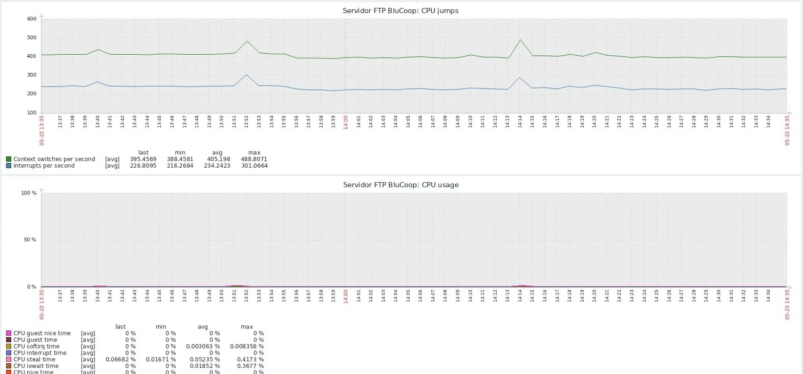

*Fonte: Elaborado pelos próprios autores.*

Tela de Hosts do Zabbix com o Servidor FTP BluCoop conectado via IP 3.87.76.149, Zabbix Agent disponível (ZBX verde), 69 itens monitorados e 14 gráficos gerados automaticamente pelos templates FTP Service e Linux by Zabbix agent.

**Figura 119 - Tela de Hosts**

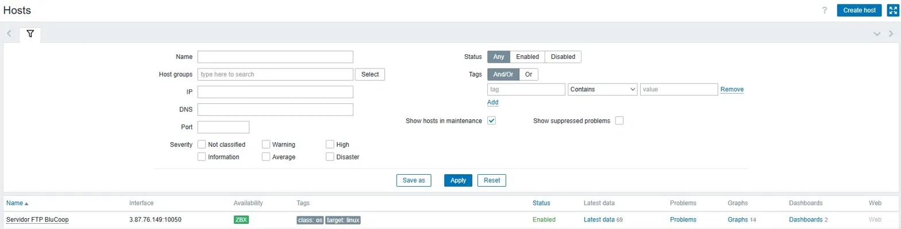

*Fonte: Elaborado pelos próprios autores.*

Gráficos de memória do Servidor FTP BluCoop. Memória total de 911 MB com média de 172 MB disponíveis. Utilização média de 81%, com trigger de alerta configurado para 90%, garantindo aviso prévio em caso de sobrecarga.

**Figura 120 - Gráficos de memória**

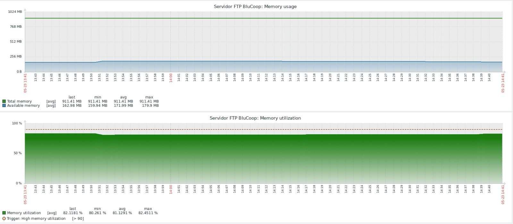

*Fonte: Elaborado pelos próprios autores.*

### 12.2.5 Elastic File System (EFS)

A imagem abaixo representa a estrutura da rede monitorada pelo Zabbix. O ambiente possui 5 matrizes e 1 filial, todas conectadas ao EFS, permitindo compartilhamento e centralização dos dados entre as unidades. O Zabbix Server atua como servidor principal de monitoramento, recebendo informações de todos os hosts conectados na rede. Os status "OK" indicam que os servidores estão ativos e funcionando corretamente, sem falhas de comunicação no momento do monitoramento.

**Figura 121 - Topologia de rede e monitoramento**

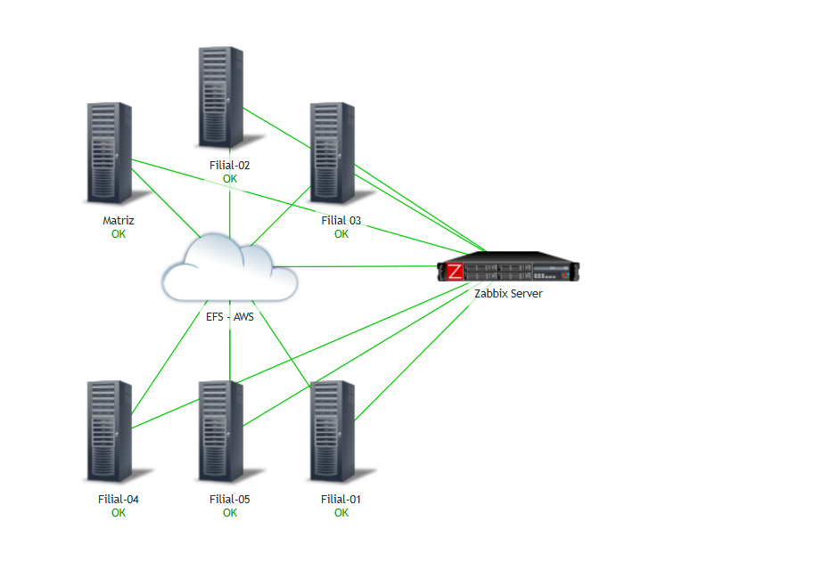

*Fonte: Elaborado pelos próprios autores.*

O gráfico de uso de disco mostra a variação do armazenamento utilizado nos servidores ao longo do tempo. É possível observar alguns picos de utilização, o que indica momentos de maior processamento ou gravação de dados no ambiente. Mesmo com essas oscilações, o consumo permaneceu controlado, sem atingir níveis críticos.

**Figura 122 - Uso de disco**

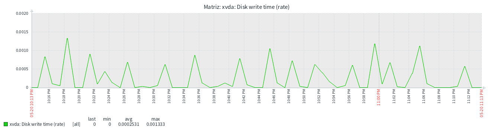

*Fonte: Elaborado pelos próprios autores.*

O gráfico de memória disponível apresenta estabilidade durante boa parte do período monitorado. Em determinados momentos há aumento da memória livre, o que pode indicar liberação de processos ou otimização do uso do sistema. Isso demonstra que o servidor mantém uma boa disponibilidade de memória para execução das aplicações e serviços.

**Figura 123 - Memória disponível**

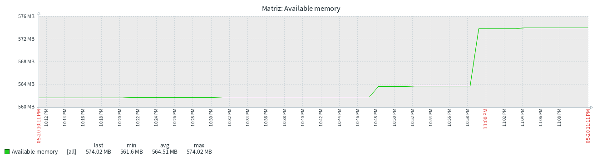

*Fonte: Elaborado pelos próprios autores.*

O gráfico de CPU mostra que o processamento permaneceu baixo na maior parte do tempo, com alguns picos rápidos de utilização. Esses picos podem ocorrer durante execuções automáticas, sincronizações ou consultas realizadas pelos servidores conectados ao EFS.

**Figura 124 - Utilização de CPU**

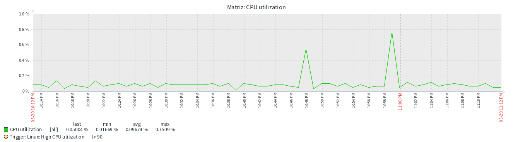

*Fonte: Elaborado pelos próprios autores.*
