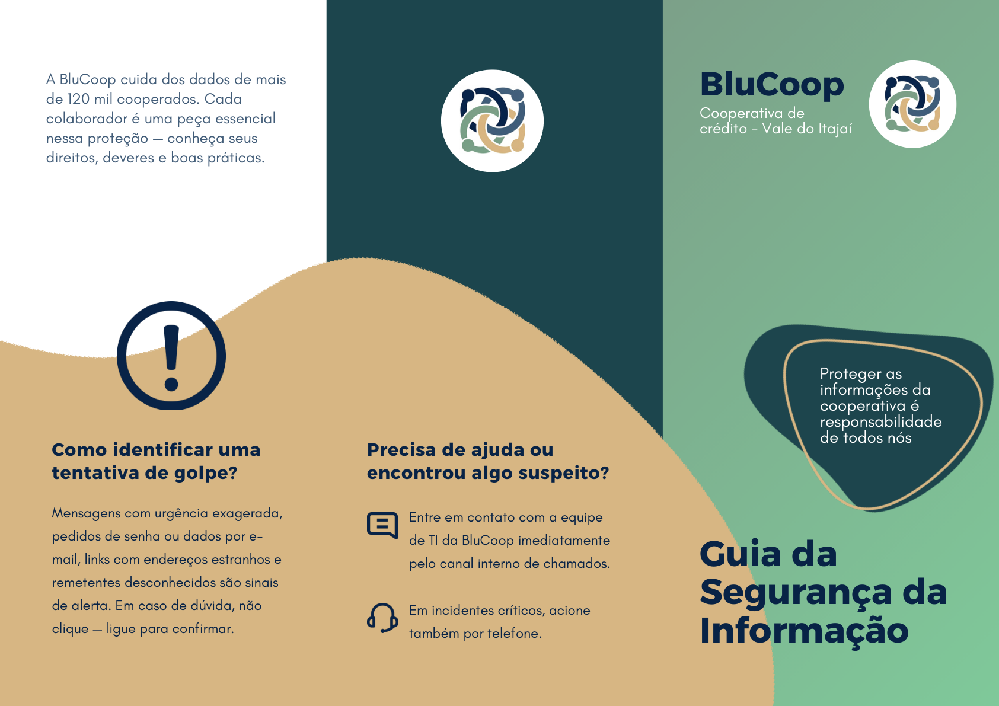
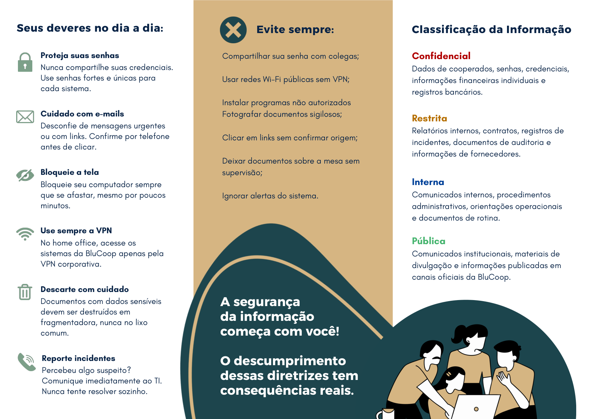

# Folder de Conscientização

Material visual criado para comunicar as principais diretrizes da Política de Segurança da Informação aos colaboradores da BluCoop.

## Arquivo

| Arquivo | Descrição |
| --- | --- |
| [folder-politica-seguranca.pdf](./folder-politica-seguranca.pdf) | PDF oficial do folder de conscientização da PSI. |

## Objetivo

O folder transforma pontos importantes da política formal em orientações rápidas, diretas e fáceis de consultar no dia a dia.

## Prévia do Folder

### Parte externa

### Parte interna

## Temas Abordados

| Tema | Orientação |
| --- | --- |
| Senhas | Usar senhas fortes, únicas e nunca compartilhá-las. |
| E-mails e golpes | Desconfiar de mensagens urgentes, links estranhos e remetentes desconhecidos. |
| Bloqueio de tela | Bloquear o computador ao se afastar. |
| VPN | Usar a VPN corporativa no acesso remoto. |
| Descarte seguro | Descartar documentos sensíveis de forma adequada. |
| Incidentes | Reportar imediatamente suspeitas à equipe de TI. |
| Classificação da informação | Diferenciar informações confidenciais, restritas, internas e públicas. |

## Condutas que Devem Ser Evitadas

- Compartilhar senha com colegas.
- Usar Wi-Fi público sem VPN.
- Instalar programas não autorizados.
- Fotografar documentos sigilosos.
- Clicar em links sem confirmar a origem.
- Deixar documentos sobre a mesa sem supervisão.
- Ignorar alertas do sistema.

## Relação com o Projeto

O folder complementa a [Política de Segurança da Informação](<../Política de Segurança da Informação/>) ao levar as diretrizes para uma linguagem mais acessível e prática.

## Material Relacionado

- [Política de Segurança da Informação](<../Política de Segurança da Informação/>)
- [Índice da PSI](../)
- [Entrega da Etapa 4](../../README.md)
