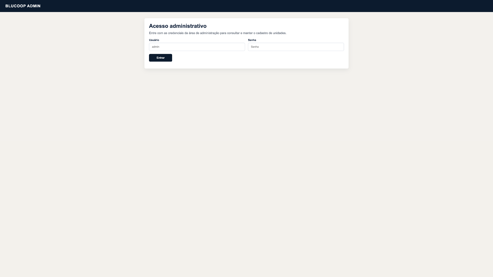
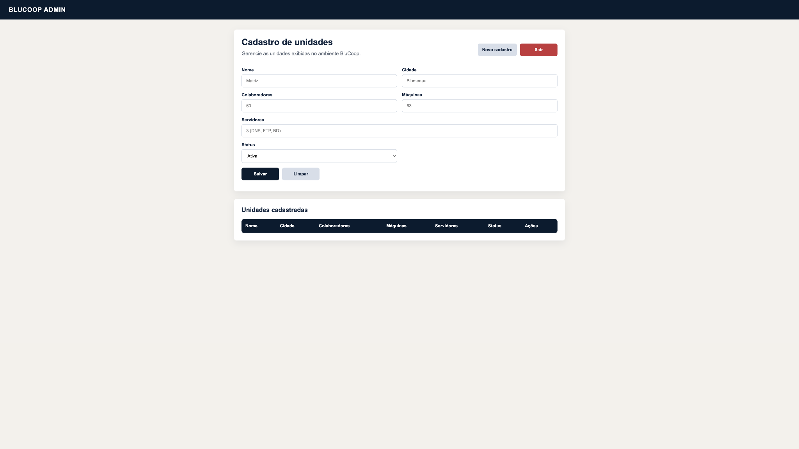
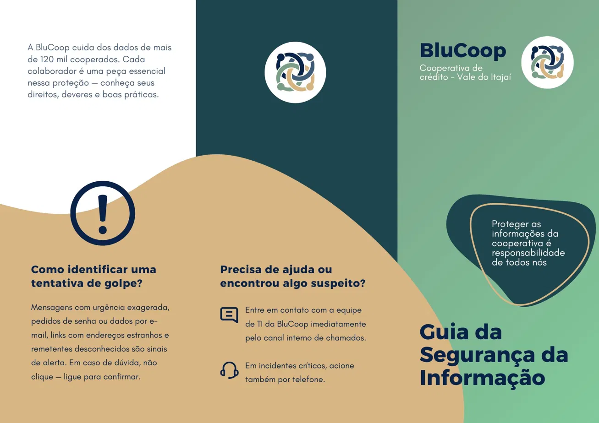
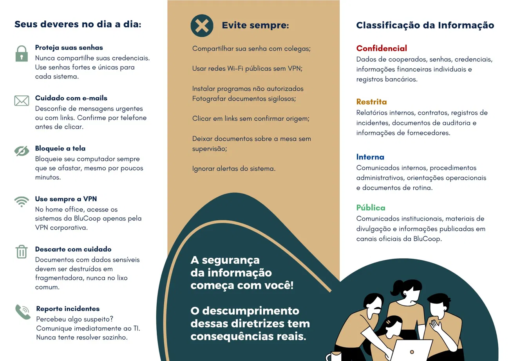

# Desenvolvimento Web Backend e Segurança da Informação

## 13 Desenvolvimento Web Backend

Como parte do projeto BluCoop, foi desenvolvida uma aplicação web funcional que atua como um sistema simples para gerenciar o cadastro de unidades da cooperativa, disponível em `https://blucoop.click/admin`.

A proposta foi transformar uma página inicialmente estática em uma aplicação com área administrativa, permitindo que os dados sejam cadastrados, consultados, alterados e excluídos diretamente pelo navegador.

A aplicação foi estruturada a partir de três camadas complementares:

- Servidor Apache, responsável pela entrega das páginas ao navegador do usuário.
- Backend em Node.js, responsável por intermediar a interface e o banco de dados, processar requisições e aplicar as regras do sistema.
- PostgreSQL, responsável pelo armazenamento persistente dos registros cadastrados.

O acesso ao sistema é protegido por uma tela de login administrativo, garantindo que apenas usuários autorizados consigam visualizar ou modificar os dados cadastrados.



**Figura 125 - Tela de Login**  
Fonte: Elaborado pelos próprios autores.

Após a autenticação, o usuário é direcionado ao painel de gerenciamento de unidades, onde é possível realizar as quatro operações fundamentais de qualquer sistema de dados: cadastrar novas unidades, consultar os registros existentes, editar informações e excluir entradas quando necessário.

Cada unidade pode ser registrada com informações como nome, cidade, quantidade de colaboradores, máquinas, servidores e status operacional.



**Figura 126 - Painel de Gerenciamento de Unidades**  
Fonte: Elaborado pelos próprios autores.

Embora se trate de uma prova de conceito, a aplicação ilustra de forma concreta o funcionamento de um sistema de gestão integrado, com dados centralizados e acessíveis por meio de uma interface simples.

## 14 Mecanismos de Segurança da Informação

A segurança da informação na BluCoop não se sustenta apenas por controles técnicos ou normas formais. Ela depende da combinação entre políticas bem estruturadas, ferramentas adequadas e pessoas conscientes de seu papel na proteção dos dados.

Nesse contexto, os mecanismos de segurança adotados pela cooperativa abrangem tanto instrumentos normativos quanto materiais de comunicação e conscientização, garantindo que as diretrizes de proteção da informação alcancem todos os colaboradores, independentemente de sua área de atuação ou nível de conhecimento técnico.

### 14.1 Política de Segurança da Informação (PSI)

A Política de Segurança da Informação da BluCoop (PSI-2026) foi construída como resposta à necessidade de formalizar e consolidar, em um único documento estruturado, as diretrizes, os controles e as responsabilidades relacionadas à proteção das informações da cooperativa em todas as suas dimensões: física, lógica, humana e regulatória.

Sua elaboração partiu do reconhecimento de que a BluCoop opera em um ambiente distribuído e de alta complexidade, o que amplia significativamente a superfície de exposição a ameaças e exige controles robustos em múltiplas camadas.

O documento foi desenvolvido com base nas melhores práticas internacionais de segurança da informação, em especial a ISO/IEC 27001:2022 e as publicações especiais do NIST. Também foi estruturado para atender às exigências regulatórias impostas pelo Banco Central do Brasil por meio das Resoluções CMN n.º 4.658/2018 e n.º 4.893/2021, bem como aos requisitos da Lei Geral de Proteção de Dados Pessoais (LGPD), Lei n.º 13.709/2018.

O PDF oficial da política está disponível em [Política de Segurança da Informação](<./PSI/Política de Segurança da Informação/politica-seguranca-informacao.pdf>).

### 14.2 Cartilha

Como complemento direto à PSI, a BluCoop desenvolveu a Cartilha de Segurança da Informação, um material de comunicação visual voltado a traduzir, em linguagem acessível e objetiva, as principais diretrizes da política para o dia a dia dos colaboradores.

A cartilha parte do princípio de que a tecnologia, por si só, não é suficiente para garantir a proteção das informações, e que cada colaborador representa uma linha de defesa essencial dentro da cooperativa. Com isso em mente, o material foi projetado para ser direto, visual e de fácil assimilação, abordando os temas de maior impacto no comportamento humano em segurança da informação.



**Figura 127 - Parte externa da Cartilha de Segurança da Informação**  
Fonte: Elaborado pelos próprios autores.



**Figura 128 - Parte interna da Cartilha de Segurança da Informação**  
Fonte: Elaborado pelos próprios autores.

O PDF oficial do folder está disponível em [Folder de Conscientização](<./PSI/Folder de Conscientização/folder-politica-seguranca.pdf>).

### 14.3 Análise de vulnerabilidades

Com base na classificação OWASP Top 10 (2025), este item consolida as principais fragilidades de segurança identificadas no ambiente da BluCoop, considerando a aplicação web, a API, a configuração do servidor, o uso de serviços em nuvem e a camada de banco de dados.

A análise foi realizada a partir de inspeção estática do código-fonte, validações no ambiente da EC2, testes HTTP controlados e verificação de metadados do banco PostgreSQL.

Não foram executados testes destrutivos, exploração invasiva ou alteração de dados em produção. Valores sensíveis, como senhas, identificadores internos e segredos de ambiente, foram omitidos deste documento.

#### 14.3.1 Escopo avaliado

O escopo técnico considerado nesta análise inclui:

- Aplicação Node.js/Express localizada em `/opt/blucoop-api`.
- Painel administrativo publicado em `/var/www/html/admin.html`.
- Site público publicado em `/var/www/html/index.html`.
- Servidor Apache responsável pelo proxy reverso e pela entrega dos arquivos estáticos.
- Processo da API gerenciado pelo PM2.
- Distribuição CloudFront associada ao domínio `blucoop.click`.
- Banco de dados PostgreSQL remoto utilizado pela aplicação.
- Testes HTTP locais, via domínio público e via endereço público da origem.

#### 14.3.2 Controles de segurança já implementados

Antes da descrição das vulnerabilidades, é importante registrar os controles que já reduzem parte da superfície de ataque do projeto.

As rotas administrativas de CRUD utilizam a função `requireAuth`, o que impede o acesso anônimo direto às operações de listagem, criação, edição e exclusão de unidades. Durante os testes, requisições não autenticadas para rotas protegidas retornaram o código HTTP `401`.

Também foi verificado que as consultas SQL da API utilizam parâmetros posicionais, como `$1` e `$2`, o que reduz significativamente o risco de SQL injection clássico.

Além disso:

- O cookie de sessão utiliza `httpOnly`.
- O cookie de sessão possui `sameSite` configurado como `lax`.
- A API retorna cabeçalhos de não armazenamento em cache para rotas sob `/api`.
- O domínio público utiliza HTTPS por meio do CloudFront.

Esses controles, contudo, não eliminam todos os riscos. A autenticação existente é binária, baseada apenas no estado da sessão, sem papéis, permissões granulares, MFA, token CSRF, validação de origem ou auditoria detalhada das ações administrativas.

#### 14.3.3 Síntese das vulnerabilidades identificadas

O quadro abaixo apresenta a classificação final das vulnerabilidades segundo a taxonomia OWASP Top 10 (2025).

**Quadro 01 - Matriz de vulnerabilidades conforme OWASP Top 10 (2025)**

| Código OWASP | Categoria | Severidade | Situação identificada no projeto |
| --- | --- | --- | --- |
| A01 | Broken Access Control | Média/Alta | O CRUD exige sessão autenticada, porém não há autorização granular, token CSRF ou validação explícita de origem. |
| A02 | Security Misconfiguration | Alta | Há ausência de cabeçalhos de segurança, exposição de fingerprinting, origem HTTP acessível por IP público e API escutando em todas as interfaces. |
| A03 | Software Supply Chain Failures | Média | Foi identificada vulnerabilidade moderada na dependência `qs`, além de dependências graváveis pelo mesmo usuário que executa a aplicação. |
| A04 | Cryptographic Failures | Alta/Crítica | Segredos são mantidos em `.env`, com baixa entropia, permissão permissiva e conexão PostgreSQL sem SSL. |
| A05 | Injection | Alta | SQL injection está mitigado por queries parametrizadas, mas há XSS armazenado no painel administrativo por uso de `innerHTML`. |
| A06 | Insecure Design | Média/Alta | A área administrativa depende de uma credencial única, sem MFA, usuários individuais, RBAC ou modelo formal de auditoria. |
| A07 | Authentication Failures | Alta | O login não possui rate limit, bloqueio progressivo ou atraso incremental; a sessão não é regenerada após autenticação. |
| A08 | Software/Data Integrity Failures | Média/Alta | Backend e banco não reforçam regras de negócio como allowlist de `status` e restrição para números não negativos. |
| A09 | Logging and Alerting Failures | Alta | Existem logs operacionais, mas não há auditoria estruturada nem alertas de segurança para login, logout e CRUD. |
| A10 | Mishandling of Exceptional Conditions | Alta | Entradas inválidas retornam HTML com stack trace público e caminhos internos da aplicação. |

Fonte: Elaborado pelos próprios autores, com base em OWASP Top 10 (2025).

#### 14.3.4 A01 - Broken Access Control

- Categoria: A01:2025 - Broken Access Control.
- Severidade: Média/Alta.
- Situação no projeto: o controle de acesso básico está implementado por meio da função `requireAuth`, utilizada nas rotas de CRUD de unidades. Esse controle é relevante, pois impede que usuários anônimos executem operações administrativas diretamente. Entretanto, o modelo atual valida apenas se a sessão está autenticada, sem aplicar autorização por papel, escopo ou tipo de ação.
- Evidências:
  - As rotas administrativas exigem sessão autenticada.
  - Requisições sem sessão retornaram `401`.
  - Não há papéis, perfis de acesso ou autorização por ação.
  - Não há token CSRF nem validação explícita de `Origin` ou `Referer`.
  - O painel administrativo é acessível publicamente pelo domínio e também pela origem HTTP direta.
- Impacto: caso uma sessão administrativa seja comprometida, o atacante poderá executar todas as ações disponíveis no CRUD. Além disso, uma exploração de XSS no navegador de um administrador autenticado pode realizar requisições administrativas usando a sessão válida.
- Recomendações:
  - Manter o `requireAuth` como controle mínimo obrigatório.
  - Implementar autorização por papel ou perfil de acesso.
  - Adicionar token CSRF ou validação forte de origem.
  - Registrar ações administrativas por usuário autenticado.
  - Restringir o acesso direto à origem pública da EC2.

#### 14.3.5 A02 - Security Misconfiguration

- Categoria: A02:2025 - Security Misconfiguration.
- Severidade: Alta.
- Situação no projeto: o domínio público utiliza HTTPS por meio do CloudFront. Contudo, a origem EC2 também responde diretamente por HTTP via IP público, permitindo contornar os controles aplicados na distribuição. O Apache expõe informações de versão, a API expõe `X-Powered-By: Express` e não há política consistente de cabeçalhos de segurança.
- Evidências:
  - O Apache possui virtual host ativo em `*:80`.
  - O IP público da origem responde `200` para `/admin` e `/api/session`.
  - As respostas expõem `Server: Apache/2.4.58 (Ubuntu)`.
  - A API expõe `X-Powered-By: Express`.
  - Não foram identificados cabeçalhos consistentes de HSTS, CSP, Referrer-Policy, Permissions-Policy ou `frame-ancestors`.
  - A API Node escuta em `*:3000`; o acesso externo está bloqueado pelo Security Group, mas a porta responde dentro da VPC.
  - O firewall local está inativo, fazendo com que a proteção dependa das regras de Security Group.
- Impacto: o acesso direto à origem permite bypass do CloudFront e tráfego HTTP sem a proteção esperada no domínio principal. A ausência de cabeçalhos de segurança aumenta o impacto de XSS, clickjacking e fingerprinting.
- Recomendações:
  - Restringir a porta 80 da origem para aceitar apenas tráfego autorizado do CloudFront.
  - Configurar TLS também na origem ou garantir política segura de comunicação com a origem.
  - Adicionar HSTS, CSP, `frame-ancestors`, Referrer-Policy e Permissions-Policy.
  - Remover o cabeçalho `X-Powered-By`.
  - Ajustar `ServerTokens` e `ServerSignature` no Apache.
  - Fazer a API escutar em `127.0.0.1` quando o acesso externo direto não for necessário.

#### 14.3.6 A03 - Software Supply Chain Failures

- Categoria: A03:2025 - Software Supply Chain Failures.
- Severidade: Média.
- Situação no projeto: o ambiente possui `package.json` e `package-lock.json`, o que permite rastrear dependências. Entretanto, o `npm audit` identificou vulnerabilidade moderada na dependência `qs`. Também foi observado que o diretório `node_modules` é gravável pelo mesmo usuário que executa a aplicação.
- Evidências:
  - Dependências principais identificadas: `express`, `express-session`, `pg` e `dotenv`.
  - `npm audit` indicou vulnerabilidade moderada em `qs`.
  - `node_modules` é gravável pelo usuário de execução da aplicação.
- Impacto: dependências vulneráveis podem introduzir falhas de disponibilidade ou segurança. Dependências graváveis pelo usuário runtime aumentam o impacto de eventual comprometimento desse usuário, permitindo persistência ou alteração de bibliotecas.
- Recomendações:
  - Aplicar correção de dependências em janela controlada.
  - Executar testes básicos após atualização.
  - Restringir permissões de escrita do usuário runtime sobre dependências.
  - Adotar verificação automatizada de dependências no pipeline.

#### 14.3.7 A04 - Cryptographic Failures

- Categoria: A04:2025 - Cryptographic Failures.
- Severidade: Alta/Crítica.
- Situação no projeto: a aplicação utiliza arquivo `.env` para armazenar credenciais e segredos. O arquivo possui permissão permissiva, os segredos possuem baixa entropia e a conexão entre aplicação e PostgreSQL foi validada sem SSL.
- Evidências:
  - A aplicação carrega variáveis por meio de `dotenv`.
  - O arquivo `.env` está presente em `/opt/blucoop-api`.
  - A permissão do `.env` é `644`.
  - O processo Node roda como `ubuntu` e consegue ler o arquivo porque ele é legível por outros usuários.
  - O segredo de sessão e as senhas possuem comprimentos reduzidos.
  - Não foi identificado uso de AWS Secrets Manager ou SSM Parameter Store.
  - A consulta em `pg_stat_ssl` indicou `ssl=false` para a conexão da aplicação com o banco.
  - Valores sensíveis foram expostos durante a coleta e devem ser considerados comprometidos.
- Impacto: usuários locais podem ler segredos da aplicação. Segredos de baixa entropia reduzem a resistência contra ataques de força bruta. A ausência de SSL no PostgreSQL expõe o tráfego da aplicação com o banco em caso de captura ou comprometimento da rede privada.
- Recomendações:
  - Rotacionar credenciais e segredos expostos.
  - Utilizar segredo de sessão aleatório com pelo menos 32 bytes.
  - Armazenar senha administrativa com hash forte, como Argon2id ou bcrypt.
  - Restringir permissões do arquivo `.env`.
  - Utilizar AWS Secrets Manager ou SSM Parameter Store.
  - Habilitar SSL/TLS na conexão com PostgreSQL.

#### 14.3.8 A05 - Injection

- Categoria: A05:2025 - Injection.
- Severidade: Alta.
- Situação no projeto: não foi identificado SQL injection nas rotas analisadas, pois as consultas utilizam parâmetros. Entretanto, foi confirmado risco de XSS armazenado no painel administrativo, decorrente da interpolação de dados retornados da API em `innerHTML`.
- Evidências:
  - As consultas SQL utilizam `pool.query` com parâmetros posicionais.
  - O painel administrativo utiliza `tbody.innerHTML`.
  - O painel administrativo utiliza `tr.innerHTML` com dados como nome, cidade, servidores e status.
  - Existem manipuladores inline como `onclick`.
  - O backend não sanitiza nem escapa os campos antes de persistir ou retornar os dados.
- Impacto: um payload JavaScript armazenado no banco pode ser executado no navegador de um administrador ao listar unidades. Mesmo com cookie `httpOnly`, o script pode realizar chamadas autenticadas usando a sessão existente.
- Exemplo de payload demonstrativo:

```html

```

- Recomendações:
  - Substituir `innerHTML` por `textContent` e criação segura de elementos DOM.
  - Remover manipuladores inline e utilizar `addEventListener`.
  - Implementar CSP restritiva após a remoção de scripts inline.
  - Validar e limitar campos recebidos no backend.

#### 14.3.9 A06 - Insecure Design

- Categoria: A06:2025 - Insecure Design.
- Severidade: Média/Alta.
- Situação no projeto: a área administrativa depende de uma credencial única definida em ambiente, sem usuários individuais, autenticação multifator, separação de papéis ou trilha formal de auditoria.
- Evidências:
  - Login administrativo baseado em usuário e senha definidos no `.env`.
  - Ausência de MFA.
  - Ausência de RBAC.
  - Ausência de usuários administrativos individuais.
  - Ausência de modelo formal de auditoria.
- Impacto: o comprometimento de uma única credencial compromete todo o painel administrativo. Além disso, não é possível atribuir ações a usuários individuais, o que dificulta responsabilização e investigação.
- Recomendações:
  - Criar usuários administrativos individuais.
  - Implementar MFA.
  - Implementar RBAC.
  - Definir trilha de auditoria para ações sensíveis.

#### 14.3.10 A07 - Authentication Failures

- Categoria: A07:2025 - Authentication Failures.
- Severidade: Alta.
- Situação no projeto: o endpoint de login não possui rate limit, lockout ou atraso incremental. A sessão Express utiliza store em memória e não é regenerada após autenticação.
- Evidências:
  - Doze tentativas inválidas via HTTPS retornaram sempre `401`.
  - Doze tentativas inválidas via localhost retornaram sempre `401`.
  - Não houve resposta `429`, bloqueio ou atraso progressivo.
  - A senha administrativa possui comprimento reduzido.
  - `express-session` não possui store configurado.
  - Não há chamada a `req.session.regenerate()` no login.
  - O PM2 mostrou `node env: N/A`.
- Impacto: ataques de força bruta e credential stuffing tornam-se mais viáveis. O uso de sessão em memória não é adequado para produção e a ausência de regeneração de sessão aumenta o risco de session fixation.
- Recomendações:
  - Adicionar rate limit por IP e por usuário.
  - Implementar bloqueio temporário ou atraso incremental.
  - Utilizar hash forte para senha administrativa.
  - Regenerar a sessão após autenticação.
  - Configurar store persistente para sessões.
  - Definir `NODE_ENV=production`.

#### 14.3.11 A08 - Software and Data Integrity Failures

- Categoria: A08:2025 - Software and Data Integrity Failures.
- Severidade: Média/Alta.
- Situação no projeto: o backend e o banco não reforçam completamente as regras de negócio. O front limita alguns valores, mas o servidor aceita valores fora do domínio esperado, e o banco não possui constraints suficientes para impedir inconsistências.
- Evidências:
  - O backend não valida allowlist de status.
  - O front limita status a `Ativa` e `Sede`, mas o backend aceita qualquer valor.
  - A tabela `unidades` possui apenas chave primária como constraint.
  - Não há `CHECK` para status.
  - Não há `CHECK` para impedir números negativos em colaboradores e máquinas.
  - O usuário de banco da aplicação possui privilégios além do CRUD, incluindo `TRUNCATE`, `TRIGGER` e `REFERENCES`.
- Impacto: clientes podem burlar o front e persistir estados inválidos. A ausência de constraints reduz a garantia de integridade dos dados. Privilégios excessivos aumentam o impacto de uma eventual exploração da aplicação.
- Recomendações:
  - Validar payloads com schema no backend.
  - Aplicar allowlist de status.
  - Criar constraints `CHECK` para status, colaboradores `>= 0` e máquinas `>= 0`.
  - Remover privilégios desnecessários do usuário runtime.
  - Separar usuário de migração/administração do usuário da aplicação.

#### 14.3.12 A09 - Security Logging and Alerting Failures

- Categoria: A09:2025 - Security Logging and Alerting Failures.
- Severidade: Alta.
- Situação no projeto: existem logs operacionais do Apache e do PM2, mas não foi identificada auditoria estruturada de eventos sensíveis. Falhas de login aparecem apenas como requisições `401` no log do Apache, sem contexto suficiente de segurança na aplicação.
- Evidências:
  - Apache access log registra requisições e códigos HTTP.
  - PM2 registra inicialização e erros.
  - Não há log estruturado de login falho, login bem-sucedido, logout, criação, atualização ou exclusão.
  - Não há tabela de auditoria dedicada observada no banco.
  - Scans contra arquivos `.env` aparecem apenas em logs brutos.
  - Logs de erro expõem stack traces e informações internas.
- Impacto: ataques podem não ser detectados em tempo adequado. Em caso de incidente, a ausência de auditoria estruturada dificulta identificar origem, usuário, ação executada e registro afetado.
- Recomendações:
  - Utilizar logger estruturado.
  - Criar eventos de auditoria para login, logout e CRUD.
  - Registrar usuário, IP, user-agent, ação, registro afetado e resultado.
  - Criar alertas para muitas respostas `401`, `403` e `500`.
  - Redigir informações sensíveis em logs.

#### 14.3.13 A10 - Mishandling of Exceptional Conditions

- Categoria: A10:2025 - Mishandling of Exceptional Conditions.
- Severidade: Alta.
- Situação no projeto: erros de entrada são retornados ao usuário com HTML contendo stack trace e caminhos internos da aplicação.
- Evidências:
  - `POST /api/login` sem JSON retorna `500` com stack trace público.
  - JSON malformado retorna `400` com stack trace público.
  - O vazamento ocorre pelo domínio HTTPS e pela origem.
  - O stack trace revela caminhos como `/opt/blucoop-api/server.js`, linhas exatas, bibliotecas e diretórios de `node_modules`.
- Impacto: essas informações facilitam reconhecimento técnico e reduzem o esforço necessário para explorar outras falhas, como XSS, falhas de autenticação e dependências vulneráveis.
- Recomendações:
  - Definir `NODE_ENV=production`.
  - Adicionar middleware global de tratamento de erros.
  - Responder erros com JSON genérico.
  - Validar `req.body` antes de realizar destructuring.
  - Tratar explicitamente erro de parse JSON.

#### 14.3.14 Priorização das correções

**Quadro 02 - Priorização das ações de correção**

| Prioridade | Ações recomendadas |
| --- | --- |
| P0 - Urgente | Rotacionar segredos expostos; corrigir XSS armazenado; remover stack traces públicos; bloquear acesso direto ao IP público da origem; adicionar rate limit no login; remover privilégios excessivos do usuário de banco. |
| P1 - Alto valor | Adicionar headers de segurança; remover `X-Powered-By`; configurar store persistente de sessão; regenerar sessão após login; implementar validação server-side; criar constraints no banco; habilitar SSL/TLS no PostgreSQL; corrigir vulnerabilidade em `qs`; restringir permissões do `.env`. |
| P2 - Maturidade | Implementar MFA; criar usuários individuais e RBAC; estruturar auditoria de CRUD; criar alertas de segurança; reduzir permissões de escrita do usuário runtime no deploy. |

Fonte: Elaborado pelos próprios autores.

#### 14.3.15 Considerações finais

A análise demonstrou que o ambiente possui controles relevantes, especialmente autenticação nas rotas administrativas e uso de consultas SQL parametrizadas. Esses mecanismos reduzem riscos importantes e devem ser mantidos.

As principais melhorias necessárias concentram-se na correção do XSS armazenado, remoção de stack traces públicos, rotação e proteção de segredos, endurecimento da autenticação e das sessões, bloqueio do acesso direto à origem, aplicação de cabeçalhos de segurança, redução de privilégios no banco e criação de auditoria estruturada.
