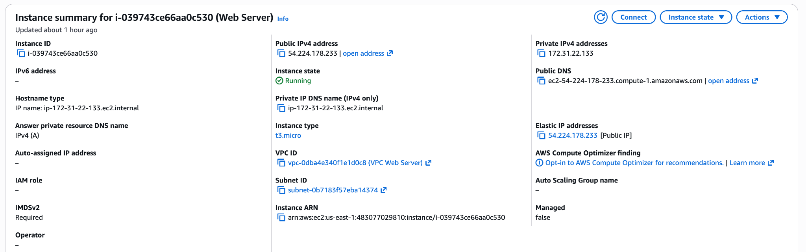
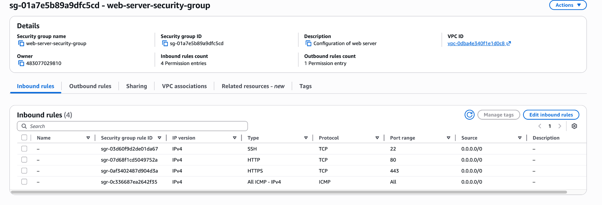
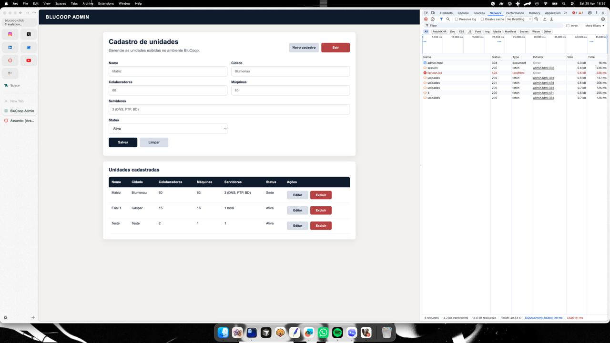
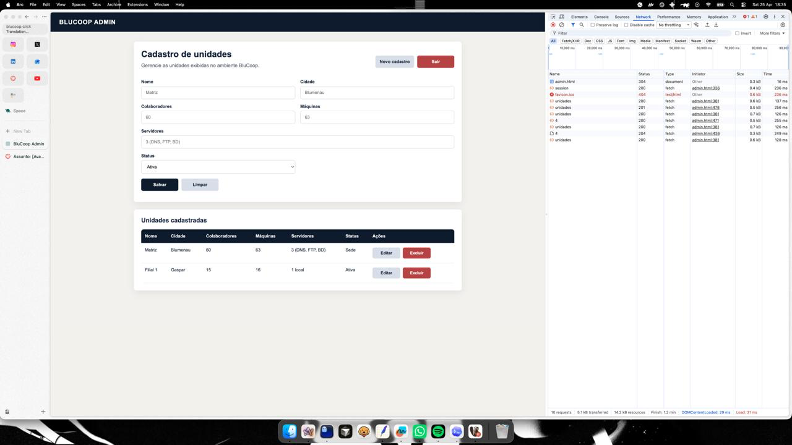

# Configuração da EC2 como Servidor Web

Este documento descreve como a instância EC2 foi configurada para executar o servidor web da BluCoop, servindo o frontend pelo Apache e encaminhando as rotas `/api` para o backend Node.js/Express.

## 1. Provisionamento da EC2

A instância foi criada na AWS com a seguinte configuração:

| Item | Configuração |
| --- | --- |
| AMI | Ubuntu Noble 24.04 |
| Tipo | `t3.micro` |
| Nome da instância | Web Server |
| VPC | VPC Web Server |
| Elastic IP | `54.224.178.233` |
| DNS público | `ec2-54-224-178-233.compute-1.amazonaws.com` |
| Security Group | `web-server-security-group` |



As regras de entrada usadas no Security Group foram:

| Serviço | Protocolo | Porta | Origem |
| --- | --- | ---: | --- |
| SSH | TCP | 22 | `0.0.0.0/0` |
| HTTP | TCP | 80 | `0.0.0.0/0` |
| HTTPS | TCP | 443 | `0.0.0.0/0` |
| All ICMP - IPv4 | ICMP | Todas | `0.0.0.0/0` |



> Observação: as regras foram mantidas abertas por se tratar de uma prova de conceito. Em ambiente de produção, o acesso SSH deve ser restrito a IPs autorizados.

## 2. Acesso SSH

O acesso à instância foi realizado por SSH usando a chave `web-server.pem`:

```bash
ssh -i "web-server.pem" ubuntu@ec2-54-224-178-233.compute-1.amazonaws.com
```

## 3. Instalação do Apache

Após acessar a instância, o sistema foi atualizado e o Apache foi instalado:

```bash
sudo apt update
sudo apt install apache2 -y
```

Em seguida, o serviço foi iniciado, habilitado no boot e validado:

```bash
sudo systemctl start apache2
sudo systemctl enable apache2
sudo systemctl status apache2
```

O frontend público foi publicado em:

```text
/var/www/html/index.html
```

Para editar o arquivo:

```bash
sudo nano /var/www/html/index.html
```

## 4. Pré-requisito do PostgreSQL

Antes de subir a API, foi criada a tabela `unidades` no banco PostgreSQL:

```sql
create table unidades (
  id serial primary key,
  nome varchar(100) not null,
  cidade varchar(100) not null,
  colaboradores integer not null,
  maquinas integer not null,
  servidores varchar(150) not null,
  status varchar(30) not null default 'Ativa'
);
```

Também foram inseridos dados iniciais:

```sql
insert into unidades (nome, cidade, colaboradores, maquinas, servidores, status)
values
('Matriz', 'Blumenau', 60, 63, '3 (DNS, FTP, BD)', 'Sede'),
('Filial 1', 'Gaspar', 15, 16, '1 local', 'Ativa');
```

## 5. Instalação do Node.js e npm

Na EC2 web, foram instalados Node.js e npm:

```bash
sudo apt install -y nodejs npm
node -v
npm -v
```

## 6. Criação do backend

O backend foi criado em `/opt/blucoop-api`:

```bash
sudo mkdir -p /opt/blucoop-api
sudo chown $USER:$USER /opt/blucoop-api
cd /opt/blucoop-api
```

O projeto Node foi inicializado e as dependências foram instaladas:

```bash
npm init -y
npm install express pg express-session dotenv
```

## 7. Variáveis de ambiente

As variáveis de ambiente foram configuradas no arquivo:

```text
/opt/blucoop-api/.env
```

Exemplo seguro de configuração:

```env
PORT=3000

DB_HOST=<IP_ELASTICO_DA_EC2_DO_BD>
DB_PORT=5432
DB_NAME=blucoop
DB_USER=<USUARIO_DO_BANCO>
DB_PASSWORD=<SENHA_FORTE_DO_BANCO>

SESSION_SECRET=<SEGREDO_FORTE_DA_SESSAO>
ADMIN_USER=<USUARIO_ADMIN>
ADMIN_PASSWORD=<SENHA_FORTE_ADMIN>
```

No repositório, esse modelo está documentado em [`../opt/blucoop-api/.env.example`](../opt/blucoop-api/.env.example). O `.env` real não deve ser versionado.

## 8. Backend Node/Express

O backend foi implementado no arquivo:

```text
/opt/blucoop-api/server.js
```

No `server.js`, foram implementados:

- Conexão com PostgreSQL usando `pg`.
- Sessão administrativa com `express-session`.
- Middleware `requireAuth` para proteger o CRUD.
- Headers anti-cache nas rotas `/api`.
- Rotas de autenticação e CRUD:
  - `POST /api/login`
  - `POST /api/logout`
  - `GET /api/session`
  - `GET /api/unidades`
  - `POST /api/unidades`
  - `PUT /api/unidades/:id`
  - `DELETE /api/unidades/:id`

Teste inicial da API direto no Node:

```bash
cd /opt/blucoop-api
node server.js
curl http://127.0.0.1:3000/api/unidades
```

Esse teste validou que o Node estava funcionando e que a API conseguia se conectar ao banco.

## 9. Subida da API com PM2

Para manter o processo Node em execução, foi usado o PM2:

```bash
sudo npm install -g pm2

cd /opt/blucoop-api
pm2 start server.js --name blucoop-api
pm2 save
pm2 startup
pm2 status
```

Para consultar logs e reiniciar após alterações:

```bash
pm2 logs blucoop-api
pm2 restart blucoop-api --update-env
```

## 10. Apache como proxy reverso

Foram habilitados os módulos necessários no Apache:

```bash
sudo a2enmod proxy
sudo a2enmod proxy_http
sudo a2enmod headers
```

O virtual host foi editado em:

```text
/etc/apache2/sites-available/000-default.conf
```

A configuração funcional encaminha `/api` para o Node local na porta `3000`:

```apache
<VirtualHost *:80>
        ServerAdmin webmaster@localhost
        DocumentRoot /var/www/html

        ProxyPreserveHost On
        RequestHeader set X-Forwarded-Proto "https"
        ProxyPass /api http://127.0.0.1:3000/api
        ProxyPassReverse /api http://127.0.0.1:3000/api

        ErrorLog ${APACHE_LOG_DIR}/error.log
        CustomLog ${APACHE_LOG_DIR}/access.log combined
</VirtualHost>
```

Após a alteração, a configuração foi validada e o Apache recarregado:

```bash
sudo apache2ctl configtest
sudo systemctl reload apache2
```

Teste local passando pelo Apache:

```bash
curl http://127.0.0.1/api/unidades
```

Esse teste validou que o Apache entregava o frontend e encaminhava `/api/*` para o Node.

## 11. Área administrativa

A área administrativa foi criada em:

```text
/var/www/html/admin.html
```

A tela administrativa implementou:

- Login admin.
- Verificação de sessão.
- Formulário de cadastro.
- Listagem de unidades.
- Edição de unidades.
- Exclusão de unidades.

URL funcional usada:

```text
https://blucoop.click/admin
```

### CRUD






## 12. CloudFront para a API

Como o domínio estava atrás de Route 53, ACM e CloudFront, foi necessário criar ou ajustar o behavior `/api/*`.

Configurações usadas:

| Configuração | Valor |
| --- | --- |
| Path pattern | `/api/*` |
| Viewer protocol policy | Redirect HTTP to HTTPS |
| Allowed HTTP methods | GET, HEAD, OPTIONS, PUT, POST, PATCH, DELETE |
| Cache policy | CachingDisabled |
| Origin request policy | AllViewer |

Depois da alteração, foi feita a invalidation:

```text
/*
```

Essa configuração foi importante para:

- Permitir login por `POST`.
- Permitir `PUT` e `DELETE`.
- Encaminhar cookies.
- Evitar cache na API.

## 13. Visão final da arquitetura


## Arquivos relacionados no repositório

| Arquivo | Descrição |
| --- | --- |
| [`../var/www/html/index.html`](../var/www/html/index.html) | Frontend público. |
| [`../var/www/html/admin.html`](../var/www/html/admin.html) | Painel administrativo. |
| [`../opt/blucoop-api/server.js`](../opt/blucoop-api/server.js) | Backend Node.js/Express. |
| [`../opt/blucoop-api/.env.example`](../opt/blucoop-api/.env.example) | Modelo seguro das variáveis de ambiente. |
| [`../etc/apache2/sites-available/000-default.conf`](../etc/apache2/sites-available/000-default.conf) | Virtual host do Apache com proxy reverso para a API. |
